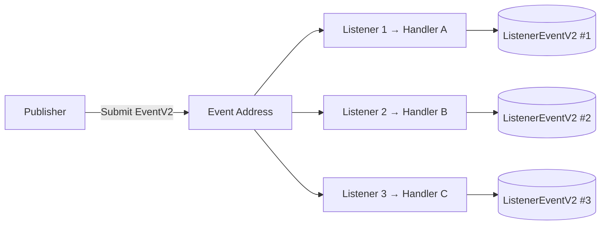
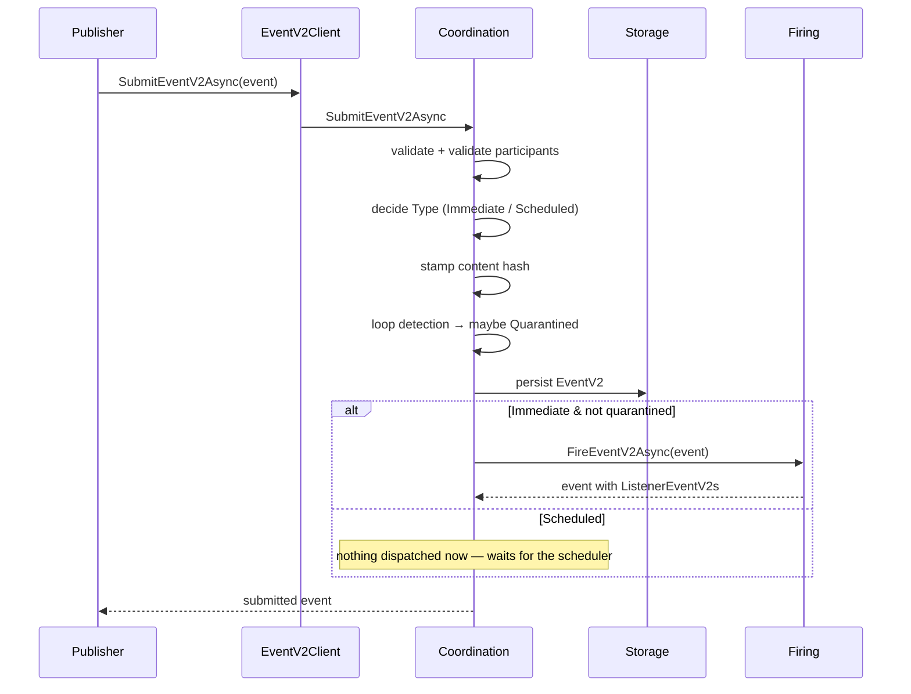
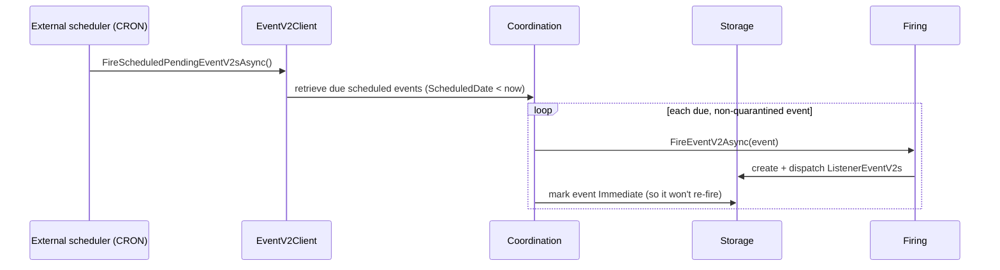
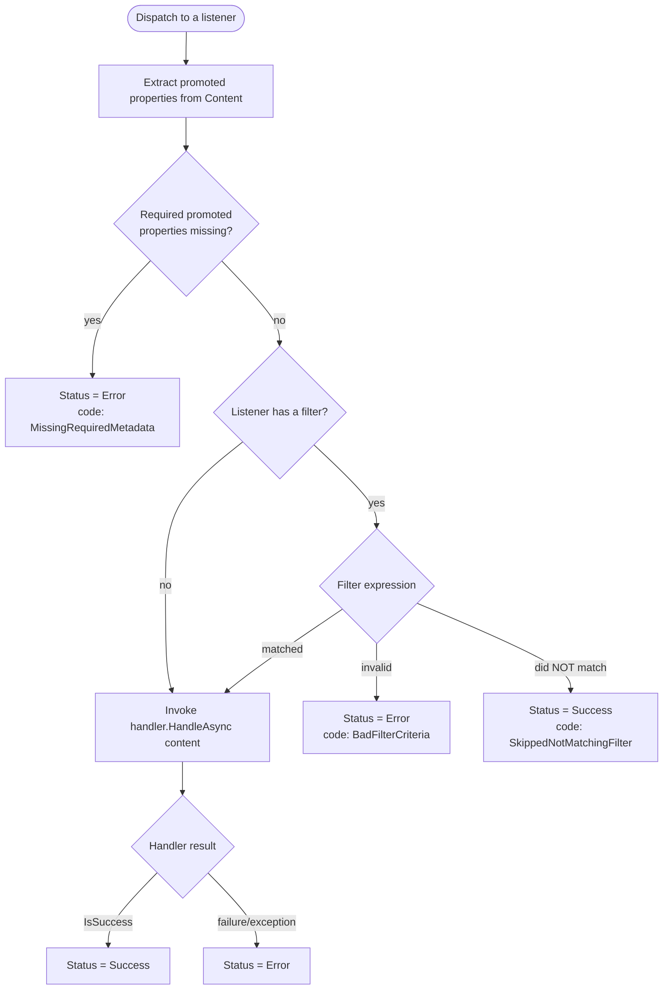
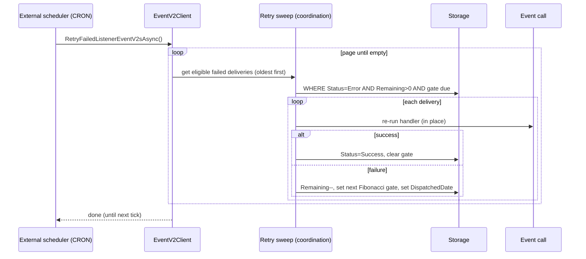
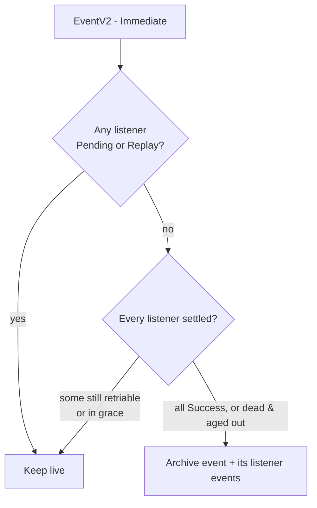
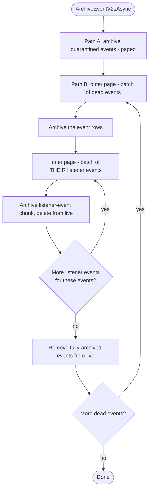
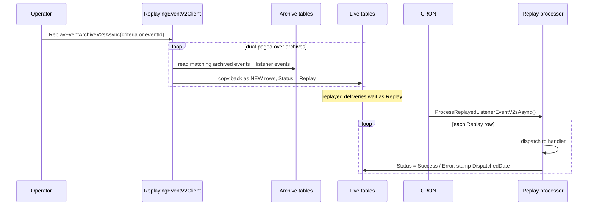
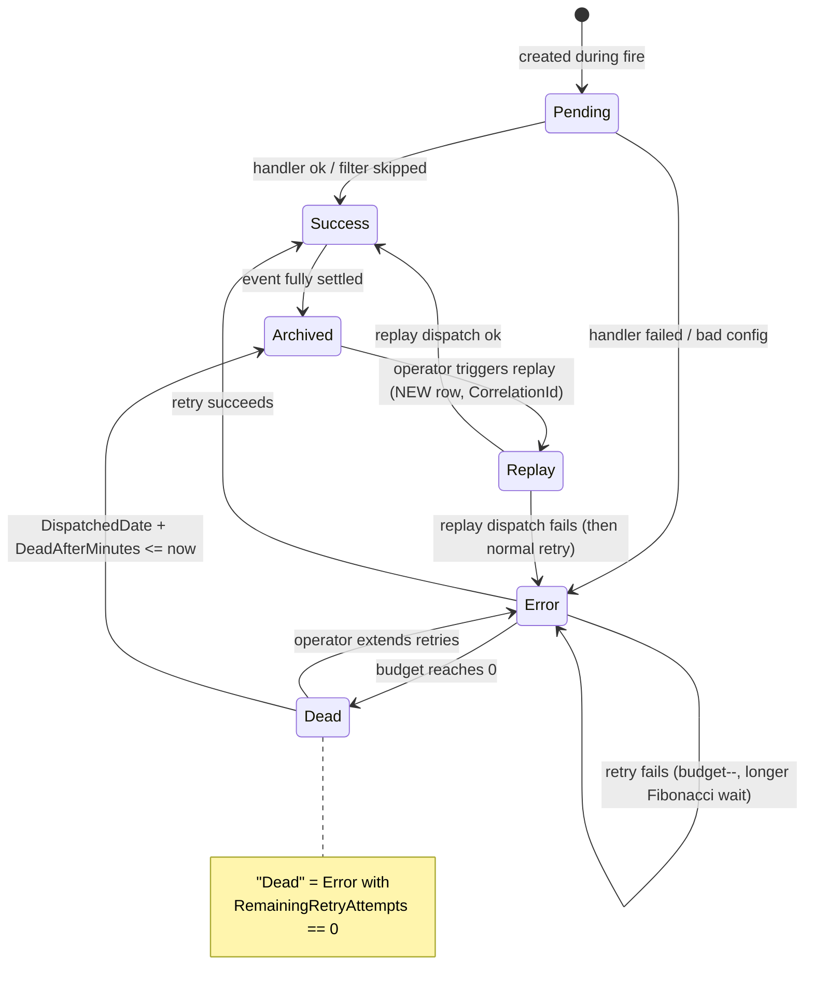

# EventHighway V2 — How It Works

> A plain-language walkthrough of the V2 event flow: publishing, dispatch, filtering, retries,
> archiving, and replay.
>
> **Scope of this document:** it describes the *target* V2 design — i.e. how the system works once the
> retry work in [`RetryChanges.md`](./RetryChanges.md) is in place. The submit, dispatch, filtering,
> archiving and replay behaviour is what exists today; the retry behaviour (Fibonacci backoff,
> listener-level budgets) is the new design and is implemented per `RetryChanges.md`.

---

## Table of contents

- [0. The mental model](#0-the-mental-model)
- [1. Submitting an event](#1-submitting-an-event)
  - [1.1 Immediate events](#11-immediate-events)
  - [1.2 Scheduled events](#12-scheduled-events)
  - [1.3 How listeners respond to a dispatched event](#13-how-listeners-respond-to-a-dispatched-event)
    - [1.3.1 Normal (unfiltered) listeners](#131-normal-unfiltered-listeners)
    - [1.3.2 Filtered listeners — match vs no-match](#132-filtered-listeners--match-vs-no-match)
  - [1.4 Loop detection & quarantine](#14-loop-detection--quarantine)
  - [1.5 Event participants & secrets](#15-event-participants--secrets)
- [2. Retries](#2-retries)
  - [2.1 The scheduling process](#21-the-scheduling-process)
  - [2.2 When a retry is in scope (and when not)](#22-when-a-retry-is-in-scope-and-when-not)
  - [2.3 The incremental (Fibonacci) delay](#23-the-incremental-fibonacci-delay)
  - [2.4 Extending retries on a dead delivery](#24-extending-retries-on-a-dead-delivery)
- [3. Archiving](#3-archiving)
  - [3.1 What is in scope for archiving (and when)](#31-what-is-in-scope-for-archiving-and-when)
  - [3.2 The dual-paged concept](#32-the-dual-paged-concept)
- [4. Replay](#4-replay)
  - [4.1 How replay works & targeted replay](#41-how-replay-works--targeted-replay)
  - [4.2 Replay copies listener events for history (not the same as retry)](#42-replay-copies-listener-events-for-history-not-the-same-as-retry)
- [5. The maintenance jobs a consumer must schedule](#5-the-maintenance-jobs-a-consumer-must-schedule)
- [6. The ListenerEventV2 lifecycle (one picture)](#6-the-listenereventv2-lifecycle-one-picture)
- [7. Configuration reference](#7-configuration-reference)

---

## 0. The mental model

EventHighway is an **in-process event bus with durable delivery records**. Five nouns carry the whole
system:

| Term | What it is |
|---|---|
| **Event Address** (`EventAddressV2`) | A named channel/topic. Everything is organised around an address. |
| **Event Listener** (`EventListenerV2`) | A subscription on an address. Points at a **handler**, and optionally carries *promoted properties* and a *filter*. |
| **Event Handler** (`IEventHandler`) | Your in-process code, registered with the client (`RegisterEventHandler`) and identified by a `HandlerId`. Its `HandleAsync(content)` returns success/failure + a response. |
| **Event** (`EventV2`) | Something that happened: JSON `Content`, an `EventName`, the target `EventAddressV2Id`, a `Type` (Immediate/Scheduled) and a `Status` (Active/Quarantined). |
| **Listener Event** (`ListenerEventV2`) | **One delivery record per (event × listener).** This is the durable receipt: its `Status` (Pending / Success / Error / Replay), the handler's response, and the retry bookkeeping. |

The golden rule: **an `EventV2` is published once, but produces one `ListenerEventV2` per matching
listener.** All the interesting lifecycle (dispatch, retry, archive, replay) happens on the
`ListenerEventV2` records — the fan-out — not on the event itself.



---

## 1. Submitting an event

You submit an event with `EventV2Client.SubmitEventV2Async(eventV2)`. The coordination service runs a
fixed sequence before anything is dispatched:

1. **Validate** the event isn't null.
2. **Validate participants** — the submitting participant (mandatory, §1.5) is validated, and its
   secret is checked when supplied or required.
3. **Decide the type** from `ScheduledDate`:
   - `ScheduledDate == null` → **Immediate**
   - `ScheduledDate < now` → **Immediate** (a past schedule means "send now")
   - otherwise → **Scheduled**
4. **Stamp a content hash** (volatile fields stripped first) — used for loop/duplicate detection.
5. **Loop detection** — see [1.4](#14-loop-detection--quarantine).
6. **Persist** the event.
7. **Dispatch** — if the event is **Immediate** (and not quarantined), fire it now (§1.1). If it's
   **Scheduled**, it just waits (§1.2).



### 1.1 Immediate events

An **Immediate** event is dispatched synchronously inside the submit call. Firing
(`FireEventV2Async`) does this:

1. Look up **all listeners** registered on the event's address.
2. For **each** listener:
   1. Create a `ListenerEventV2` in **`Pending`** status (this is the delivery receipt) and insert it.
   2. **Run the event call** against that listener's handler (§1.3).
   3. Record the outcome on the `ListenerEventV2` — **`Success`** or **`Error`** — with the handler's
      response, and update it.

So by the time `SubmitEventV2Async` returns for an Immediate event, every listener has been attempted
once and has a durable receipt. Failures are **not** retried inside the submit call — they're left as
`Error` for the retry sweep to pick up later (§2).

### 1.2 Scheduled events

A **Scheduled** event (`ScheduledDate` in the future) is persisted with `Type = Scheduled` and then…
nothing happens immediately. No listener events are created yet.

A separate, consumer-scheduled job — `FireScheduledPendingEventV2sAsync` — is what actually fires them:

1. Retrieve every event where `Type == Scheduled` **and** `ScheduledDate < now`.
2. Skip any that are `Quarantined`.
3. For each due event, run the **same** `FireEventV2Async` as above (create listener events, dispatch).
4. **Mark the event `Immediate`** so it is never picked up again.



> **The library does the work; the consumer owns the clock.** EventHighway never runs its own timers.
> You call `FireScheduledPendingEventV2sAsync` on whatever cadence you like (e.g. every minute); the
> library processes everything that is due at that moment and returns.

### 1.3 How listeners respond to a dispatched event

Whether an event is Immediate or Scheduled, the actual dispatch to a listener is identical. For a given
listener the engine builds an **event call** and runs it. Two optional listener features shape what
happens: **promoted properties** and a **filter**.

- **Promoted properties** — a comma-separated list of JSON property names on the listener. Before
  dispatch, the engine extracts those named values from the event's `Content` (case-sensitive) into a
  small metadata bag. These feed the filter and can be required.
- **Filter criteria** — a boolean expression (DynamicExpresso syntax) on the listener that decides
  whether this listener should actually handle the event, using `meta("PropertyName")` to read promoted
  values, e.g. `meta("Genre") == "Action" && meta("ReleaseYear") > "2020"`.



#### 1.3.1 Normal (unfiltered) listeners

A listener with **no filter** simply receives every event on its address. The engine:

1. Extracts any promoted properties (used only if some are marked required).
2. Invokes the registered handler's `HandleAsync(content)`.
3. Records the handler's result:
   - handler returns success → `ListenerEventV2.Status = Success`
   - handler returns failure, or throws → `ListenerEventV2.Status = Error` (eligible for retry, §2)

That's the whole path for the common case: **event in → handler runs → success/error recorded.**

#### 1.3.2 Filtered listeners — match vs no-match

A listener with a `FilterCriteria` expression only handles events that match. The important, and
slightly surprising, detail is **what a non-match counts as**:

| Situation | `ListenerEventV2.Status` | Response code | Retried? | Archivable? |
|---|---|---|---|---|
| Required promoted property missing | **Error** | `MissingRequiredMetadata` | ✅ yes | not until settled |
| Filter expression is invalid | **Error** | `BadFilterCriteria` | ✅ yes | not until settled |
| Filter **did not match** | **Success** | `SkippedNotMatchingFilter` | ❌ no | ✅ yes |
| Filter **matched**, handler succeeds | **Success** | (handler's) | ❌ no | ✅ yes |
| Filter **matched**, handler fails/throws | **Error** | (handler's) | ✅ yes | not until settled |

Key takeaways:

- **A non-matching filter is a success, not a failure.** The listener *correctly* decided this event was
  not for it. So it is recorded as `Success` with code `SkippedNotMatchingFilter`, is **not** retried,
  and is free to be archived. This is exactly what you want — a listener that filters out 99% of traffic
  shouldn't generate a mountain of "errors" to retry.
- **A broken filter or missing required metadata is an error.** These are configuration problems the
  operator can fix, so they are recorded as `Error` and *are* retried — which gives you a window to fix
  the listener config and let the retry succeed (or to extend retries, §2.4).

### 1.4 Loop detection & quarantine

Before an event is dispatched, the engine can detect runaway loops (e.g. a handler that re-publishes an
event that triggers itself). If loop detection is enabled and the same event "signature" (content hash +
address) has occurred more than `Threshold` times within the `Window`, the event is marked
**`Quarantined`**, persisted, and a `LoopDetectedEventV2CoordinationException` is thrown back to the
caller. **Quarantined events are never dispatched**, and they are swept up separately by archiving
(§3.1).

### 1.5 Event participants & secrets

Two fields on `EventV2` govern attribution and authentication:

```csharp
public string EventParticipantV2Secret { get; set; }
public Guid EventParticipantV2Id { get; set; }
```

**`EventParticipantV2Id` is mandatory** — every event is attributable to a participant, so every
publisher (including in-process, "internal" ones) submits under a participant identity created up
front, alongside its event address. The column is NOT NULL on both `EventV2s` and
`EventArchiveV2s`, the foundation service validates it as required on add, modify and restore, and
"validate participants" (step 2 of §1's sequence) means:

1. **A participant id must be supplied** — a missing/empty id throws
   `InvalidEventParticipantV2OrchestrationException` before anything else is evaluated.
2. **The participant must exist, be active, and fall inside its own `ActiveFrom`/`ActiveTo` window.**
   If not, the same exception is thrown and the event is never persisted.
3. If the participant has **`IsSecretRequired == true`**, an `EventParticipantV2Secret` **must** be
   supplied — a secretless submission for that participant throws
   `InvalidEventParticipantV2OrchestrationException`. Participants with `IsSecretRequired == false`
   (the default) may submit without a secret.
4. If `EventParticipantV2Secret` is supplied, it must match one of that participant's secrets —
   a single **matching, active, in-window** `EventParticipantSecretV2` is enough. If none match, the
   same exception is thrown. The submitted value is the **plaintext** secret; it is SHA-256-hashed
   before comparison (see below).

> **Identity is mandatory; authentication is per-participant.** The participant id answers *"where
> did this event come from"* for every row in `EventV2s` and `EventArchiveV2s` — health reports,
> loop quarantines and audits never see unattributed events. Whether the sender must also *prove*
> that identity is decided per participant via **`IsSecretRequired`**: trusted internal publishers
> can leave it off, external-facing participants should turn it on. Because events (and archives)
> always reference their participant, **deleting a participant is restricted while any of its data
> exists** — deactivate it (`IsActive = false`) instead; only its secrets cascade-delete with it.

**Secrets are hashed at rest and transient in flight.** `EventParticipantSecretV2.Secret` stores a
lowercase-hex **SHA-256 hash** — the plaintext is visible exactly once, at creation time, and cannot
be recovered afterwards (the Portal generates a strong secret and shows it a single time for this
reason). At submission the caller supplies the plaintext on `EventV2.EventParticipantV2Secret`; the
orchestration hashes it and compares hashes, and the coordination **clears the field immediately
after validation**, so the secret is never persisted on `EventV2` (the property is also ignored by
the storage mapping), never archived, and never travels further down the pipeline — replay and
restore paths operate without it.

**Secrets are time-based, and a participant can hold more than one at once.** Each
`EventParticipantSecretV2` carries its own `ActiveFrom`/`ActiveTo` window, independent of the
participant's own window, and a participant may own several secrets simultaneously. That makes
**graceful secret rotation** straightforward: create the new secret with its `ActiveFrom` set before
the old secret's `ActiveTo`, so the two windows **overlap** — external callers can switch to the new
secret whenever it suits them, while the old one keeps working until it expires on schedule. No hard
cutover, no coordinated flag-day.

---

## 2. Retries

When a delivery fails (`ListenerEventV2.Status == Error`), the engine does **not** hammer it in place.
Instead the failed record waits to be re-attempted by a consumer-scheduled sweep, with an increasing
delay between attempts. Retries operate **per listener event** — each failed delivery has its own budget,
so one flaky listener can never starve the others.

### 2.1 The scheduling process

The consumer calls `RetryFailedListenerEventV2sAsync()` on a CRON (say, every minute). Each call:

1. Reads the current time and pages through **all** listener events that are *in scope right now*
   (§2.2), **oldest first**.
2. Re-dispatches each one **in place** (it re-runs the event call on the *existing* record — it does
   **not** create a new row):
   - **success** → `Status = Success`, clear the retry gate. Done.
   - **failure** → decrement the remaining budget, compute the next delay (§2.3), stamp
     `NextRetryAttemptNotBefore`, and refresh `DispatchedDate`.
3. Keeps paging until nothing eligible remains, then returns. The next CRON tick does it again.



> The retry sweep never spins its own loop of attempts — **the CRON cadence *is* the loop.** One attempt
> per eligible item per call.

### 2.2 When a retry is in scope (and when not)

A delivery is picked up by the sweep **only** when **all** of these are true:

- `Status == Error`
- `RemainingRetryAttempts > 0` (it still has budget — not "dead")
- `NextRetryAttemptNotBefore == null` **or** `NextRetryAttemptNotBefore <= now` (its backoff window has
  elapsed)

**Not** in scope:

| State | Why it's skipped |
|---|---|
| `Success` (incl. `SkippedNotMatchingFilter`) | Nothing to retry. |
| `Pending` | Still being processed / just created. |
| `Replay` | Owned by the replay processor, not the retry sweep (§4). |
| `Error` but `RemainingRetryAttempts == 0` | **Dead** — exhausted its budget. Waits for archiving, or for an operator to *extend* it (§2.4). |
| `Error`, budget left, but gate is in the future | Backing off — will become eligible when the delay elapses. |

### 2.3 The incremental (Fibonacci) delay

Every time a retry fails, the gap before the next attempt grows along the **Fibonacci sequence, in
minutes**, so a persistently-failing endpoint is probed less and less often.

- Attempt index `n = RetryAttemptsAllowed − RemainingRetryAttempts` (grows by 1 each failed retry).
- `delay = min( Fib(n) minutes , RetryBackoffMaxMinutes )` where Fib = 1, 1, 2, 3, 5, 8, 13, 21, 34,
  55, 89, 144, 233 …
- `NextRetryAttemptNotBefore = now + delay`.

With the default budget `RetryAttemptsAllowed = 15`:

| Retry | Remaining after | index `n` | Fib(n) | Wait before next attempt |
|--:|--:|--:|--:|--:|
| initial dispatch | 15 | 0 | — | eligible immediately |
| 1 | 14 | 1 | 1 | 1 min |
| 2 | 13 | 2 | 1 | 1 min |
| 3 | 12 | 3 | 2 | 2 min |
| 4 | 11 | 4 | 3 | 3 min |
| 5 | 10 | 5 | 5 | 5 min |
| 6 | 9 | 6 | 8 | 8 min |
| 7 | 8 | 7 | 13 | 13 min |
| 8 | 7 | 8 | 21 | 21 min |
| 9 | 6 | 9 | 34 | 34 min |
| 10 | 5 | 10 | 55 | 55 min |
| 11 | 4 | 11 | 89 | 89 min |
| 12 | 3 | 12 | 144 | 144 min |
| 13 | 2 | 13 | 233 | **180 min (capped)** |
| 14 | 1 | 14 | 377 | **180 min (capped)** |
| 15 | 0 | 15 | — | **dead** (budget exhausted) |

That's roughly **12 hours** of retrying spread across 15 attempts before the delivery is declared dead —
the early attempts are close together (minutes), and once `Fib(n)` would exceed the
`RetryBackoffMaxMinutes` cap (default 180) the last few attempts settle at a steady 3-hour spacing.

### 2.4 Extending retries on a dead delivery

A dead delivery (`Error`, `RemainingRetryAttempts == 0`) sits idle, waiting to be archived. Before that
happens, an operator can bring it back into scope by **extending** it:

- `ResetRetriesForListenerEventV2ByIdAsync(id)` — one delivery.
- `ResetRetriesForListenerEventV2ByEventListenerV2IdAsync(listenerId)` — **all** failed deliveries for a
  given listener (bulk recovery after an outage; only `Error` rows are touched, never `Success`).

Extending **adds** the configured budget to both the ceiling and the remaining count and clears the
gate, so the item is immediately eligible again. Because the ceiling grows in lockstep, the Fibonacci
sequence **continues from where it left off** (longer delays) rather than restarting at 1 minute — a
persistently-failing item that keeps being extended keeps backing off, bounded by
`RetryBackoffMaxMinutes`.

---

## 3. Archiving

Archiving moves settled events out of the hot tables (`EventV2` / `ListenerEventV2`) into the archive
tables (`EventArchiveV2` / `ListenerEventArchiveV2`), keeping the live working set small and fast. It is
a consumer-scheduled job: `ArchiveEventV2sAsync()`.

There are two independent archive paths, run back-to-back:

- **Quarantined events** (loop-detected, §1.4) — archived as-is.
- **Dead events** — events whose delivery is fully finished (§3.1).

A separate purge permanently deletes archive rows past a retention date, in two forms.
`PurgeEventArchiveV2sAsync()` — the **scheduled** entry point — reads the retention window from
`EventHighwayConfiguration.Purging.RetentionDays` (default 1825 days ≈ 5 years) and deletes everything
older; `PurgeEventArchiveV2sAsync(olderThan)` deletes to an explicit threshold for **manual**/ad-hoc
purges (e.g. from the UI).

### 3.1 What is in scope for archiving (and when)

An event becomes a **dead event** (archivable) only when its whole fan-out has settled and aged out:

- `Type == Immediate` (scheduled events have already been converted to Immediate when fired), **and**
- **no** listener event is still `Pending` or `Replay`, **and**
- **every** listener event is either:
  - `Success` (handled, or correctly filter-skipped), **or**
  - `Error` **and** exhausted (`RemainingRetryAttempts == 0`) **and** aged out
    (`DispatchedDate + DeadAfterMinutes <= now`).

The `DeadAfterMinutes` grace window (default 180) is measured from the **last dispatch**, and because
`DispatchedDate` slides forward on every retry, **the window keeps extending while an item is still being
retried.** This is deliberate: it guarantees an operator always has a window to *extend* a dead delivery
(§2.4) before it's archived out of reach.

**Not** archivable (stays live):

- any listener still `Pending` or `Replay`;
- any listener still retriable (`Error`, budget left);
- any dead listener still inside its `DeadAfterMinutes` grace window.



### 3.2 The dual-paged concept

The dead-event archiver is deliberately **doubly paged** to stay memory-safe under large fan-out. The
danger case: one popular address has thousands of listeners, so a single event can have thousands of
`ListenerEventV2` rows. Loading all of them at once would blow up memory.

So archiving nests two paged loops:

- **Outer page — over dead *events*.** Grab a batch of dead events, archive the event rows.
- **Inner page — over *listener events* of those events.** For the just-archived events, page through
  their listener events in `BatchSizeForBulkProcessing` chunks; archive each chunk, then delete the
  archived listener rows from live. Repeat until that event's listeners are drained.
- Only once **all** of an event's listener events are safely archived is the event row removed from live.
  Anything that fails to archive is left in place and retried on the next run (nothing is lost).



This is the same paging discipline used by purge and by replay — the library always steps through the
whole in-scope set in bounded chunks, so memory stays flat regardless of how big the backlog or the
fan-out is.

---

## 4. Replay

Replay re-delivers events that were **already archived**. It is a deliberate, operator-triggered
operation (not automatic), and it is **completely separate from retry** — different source tables,
different trigger, different records.

### 4.1 How replay works & targeted replay

The entry point is `ReplayingEventV2Client.ReplayEventArchiveV2sAsync(...)`, in two shapes:

- **Criteria (bulk) replay** — replay everything in the archive matching optional filters:
  - `eventAddressId` — restrict to one address,
  - `eventListenerIds` — restrict to specific listeners,
  - `startDate` / `endDate` — restrict to a time window.
- **Targeted replay** — replay a single archived event by `eventV2Id` (with optional address check and an
  `allowReplayOfQuarantinedItem` opt-in, since quarantined items are skipped by default).

Mechanically, replay **copies from the archive tables back into the live tables** (this is the "restore"
step), using the same doubly-paged discipline as archiving (outer page over archived events, inner page
over their archived listener events) so a huge replay can't exhaust memory. Restored deliveries are
written as `Status = Replay`.

A second consumer-scheduled job, `ProcessReplayedListenerEventV2sAsync()`, then drains the `Replay`-status
rows: it dispatches each to its handler exactly like a first-time send, and records `Success` / `Error`.



### 4.2 Replay copies listener events for history (not the same as retry)

This is the crucial distinction:

| | **Retry** | **Replay** |
|---|---|---|
| Operates on | the **existing** live `ListenerEventV2` row | the **archive**, copied back as **new** rows |
| Row identity | same `Id`, modified in place | **new `Id`**, with `CorrelationId` → the archived row |
| Trigger | automatic sweep (`RetryFailedListenerEventV2sAsync`) | operator-triggered (`ReplayEventArchiveV2sAsync`) |
| Purpose | keep trying a delivery that hasn't succeeded yet | re-send something that was already finished & archived |

Because replay creates a **new** `ListenerEventV2` with a fresh `Id` and a `CorrelationId` pointing back
at the archived original, **you keep a full audit trail** — you can see every time a given event was
(re)sent, and trace each replayed delivery back to the record it came from. Retry, by contrast, mutates
one record in place; it's the same delivery still trying to complete.

**How replay hands off to retry:** replay clones the archived delivery into a **new** `ListenerEventV2`
(new `Id`, `CorrelationId` → the archived row), and re-seeds its budget from config —
`RetryAttemptsAllowed` and `RemainingRetryAttempts` are both set to
`RetryConfiguration.RetryAttemptsAllowed` (the cloned values are **not** carried over) — with
`NextRetryAttemptNotBefore = null` and `DispatchedDate = null`. When the replay processor dispatches it
and it *fails*, it becomes an ordinary `Error` delivery with budget — from that point the normal retry
sweep (§2) takes over. The two features never call each other; they simply share the same columns on
`ListenerEventV2`.

---

## 5. The maintenance jobs a consumer must schedule

EventHighway runs no timers of its own. A host application (or CRON) drives these library methods. Each
one does **all** the in-scope work available at that instant (using paged/bulk processing) and returns:

| Job | Method | Typical cadence | What it does |
|---|---|---|---|
| Fire due scheduled events | `FireScheduledPendingEventV2sAsync` | frequent (e.g. 1 min) | Dispatch scheduled events whose time has come (§1.2). |
| Retry failed deliveries | `RetryFailedListenerEventV2sAsync` | frequent (e.g. 1 min) | Re-attempt eligible failed listener events with Fibonacci backoff (§2). |
| Archive | `ArchiveEventV2sAsync` | periodic (e.g. hourly) | Move quarantined + dead events to the archive (§3). |
| Purge archive | `PurgeEventArchiveV2sAsync()` | infrequent (e.g. daily) | Permanently delete archive rows older than `Purging.RetentionDays` (§3). The `PurgeEventArchiveV2sAsync(olderThan)` overload purges to an explicit threshold for manual/UI use. |
| Process replays | `ProcessReplayedListenerEventV2sAsync` | frequent while replaying | Dispatch replay-queued deliveries (§4). |
| Replay (on demand) | `ReplayEventArchiveV2sAsync(...)` | operator-triggered | Restore archived events to live for re-delivery (§4). |

---

## 6. The ListenerEventV2 lifecycle (one picture)



---

## 7. Configuration reference

All configuration is passed once to the client via `EventHighwayConfiguration`. **There are no
scheduling/interval settings** — the consumer owns timing.

| Section | Setting | Default | Meaning |
|---|---|---|---|
| `RetryConfiguration` | `RetryAttemptsAllowed` | 15 | Retry budget seeded on each new delivery; also the Fibonacci ceiling. ~12 h of retrying (last attempts capped at 3 h). |
| | `RetryBackoffMaxMinutes` | 180 | Cap on any single backoff delay (guards *extended* items). |
| | `DeadAfterMinutes` | 180 | Grace after the last dispatch before a dead delivery may be archived. |
| `Purging` | `RetentionDays` | 1825 | Age in days (≈ 5 years) beyond which the scheduled `PurgeEventArchiveV2sAsync()` deletes archive rows (§3). A retention *policy*, not a schedule — the consumer still owns purge cadence. |
| `LoopDetection` | `Enabled` / `Threshold` / `Window` | true / 5 / 60 s | Quarantine an event when the same signature recurs too often (§1.4). |
| `BatchProcessing` | `BatchSizeForBulkProcessing` | (system default) | Page size for every bulk/paged job (fire, retry, archive, purge, replay). |
| `Health` | RAG thresholds | standard | Health-dashboard classification (separate subsystem). |

---

