# EventHighway Operations Portal — Design & User Guide

> A plain-language walkthrough of the **EventHighway Operations Portal** (`EventHighway.Portal.Web`):
> what each page does, what you can see and change on it, how the row highlighting works, and how
> user access is controlled.
>
> **Scope of this document:** it describes the portal as it exists today. The portal is a Blazor
> Server application (Interactive Server render mode, CoreUI/Bootstrap styling) that sits on top of
> the EventHighway Core V2 client. For how the underlying event engine works (dispatch, retries,
> archiving, replay), see
> [`EventHighway.Core.V2.Design.md`](../EventHighway.Core/V2/EventHighway.Core.V2.Design.md).

---

## Table of contents

- [0. The mental model](#0-the-mental-model)
- [1. User access & logging in](#1-user-access--logging-in)
  - [1.1 Seeded accounts](#11-seeded-accounts)
  - [1.2 What a read-only user sees](#12-what-a-read-only-user-sees)
  - [1.3 The login flow](#13-the-login-flow)
- [2. Dashboard - Status](#2-dashboard---status)
  - [2.1 The tile groups](#21-the-tile-groups)
  - [2.2 RAG colours — how a tile gets its colour](#22-rag-colours--how-a-tile-gets-its-colour)
  - [2.3 Auto-refresh](#23-auto-refresh)
- [3. Dashboard - Stats](#3-dashboard---stats)
  - [3.1 The control bar — periods, sync and auto-refresh](#31-the-control-bar--periods-sync-and-auto-refresh)
  - [3.2 Traffic](#32-traffic)
  - [3.3 Usage by Address](#33-usage-by-address)
  - [3.4 Loop Detection](#34-loop-detection)
  - [3.5 Duplicate Detection](#35-duplicate-detection)
  - [3.6 Retry Health](#36-retry-health)
  - [3.7 Usage by Participant](#37-usage-by-participant)
- [4. Events](#4-events)
  - [4.1 The events list](#41-the-events-list)
  - [4.2 Archiving processed events](#42-archiving-processed-events)
  - [4.3 Event details](#43-event-details)
- [5. Archived Events](#5-archived-events)
  - [5.1 The archive list & purging](#51-the-archive-list--purging)
  - [5.2 Archived event details & single-item replay](#52-archived-event-details--single-item-replay)
- [6. Replay (bulk)](#6-replay-bulk)
- [7. Event Participants](#7-event-participants)
  - [7.1 The participants list](#71-the-participants-list)
  - [7.2 Participant details & secrets](#72-participant-details--secrets)
- [8. Event Addresses](#8-event-addresses)
  - [8.1 The addresses list](#81-the-addresses-list)
  - [8.2 Address details & listeners](#82-address-details--listeners)
- [9. Users](#9-users)
  - [9.1 The users list](#91-the-users-list)
  - [9.2 User details](#92-user-details)
- [10. Row highlighting reference](#10-row-highlighting-reference)
- [11. Common UI building blocks](#11-common-ui-building-blocks)
- [12. How the portal talks to EventHighway](#12-how-the-portal-talks-to-eventhighway)
- [13. My Account & Participant Management](#13-my-account--participant-management)
  - [13.1 The association](#131-the-association)
  - [13.2 Self-service pages](#132-self-service-pages)
  - [13.3 The authorization model — association is the only key](#133-the-authorization-model--association-is-the-only-key)

---

## 0. The mental model

The portal is an **operations console** for an EventHighway installation. It has two faces:

| Face | Pages | Who sees it |
|---|---|---|
| **Monitoring** | Dashboard - Status (`/`), Dashboard - Stats (`/stats`) | Every signed-in user |
| **Administration** | Events, Archived Events, Replay, Event Participants, Event Address, Users (all under `/admin/...`) | `Administrators` role only |

Everything the portal shows comes from the same five Core nouns — **Event Address**, **Event
Listener**, **Event**, **Listener Event** and **Event Participant** — plus the Identity user store
that secures the portal itself. The dashboards read the Core **Health V2** sub-clients; the admin
pages read and mutate the Core entities directly through the V2 client.

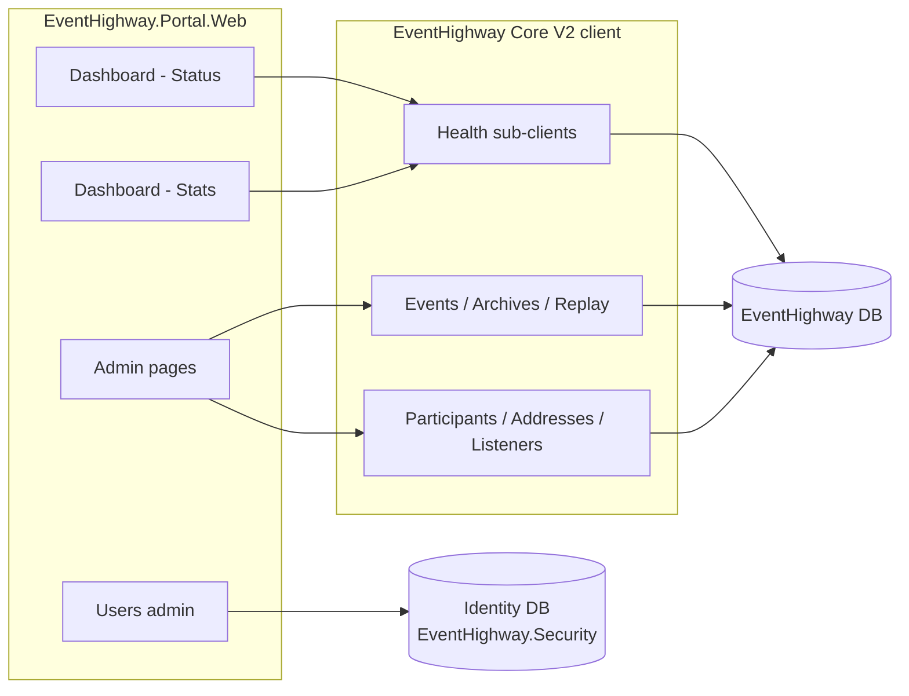
```mermaid
flowchart LR
    subgraph Portal["EventHighway.Portal.Web"]
        D1[Dashboard - Status]
        D2[Dashboard - Stats]
        A1[Admin pages]
        U1[Users admin]
    end

    subgraph Core["EventHighway Core V2 client"]
        H[Health sub-clients]
        E[Events / Archives / Replay]
        P[Participants / Addresses / Listeners]
    end

    ID[(Identity DB<br/>EventHighway.Security)]
    DB[(EventHighway DB)]

    D1 --> H
    D2 --> H
    A1 --> E
    A1 --> P
    U1 --> ID
    H --> DB
    E --> DB
    P --> DB
```

---

## 1. User access & logging in

### 1.1 Seeded accounts

On first run the portal seeds two roles — **`Administrators`** and **`Users`** — and two accounts:

| Username | Password | Role | Purpose |
|---|---|---|---|
| `admin` | `admin` | `Administrators` | Full administrative access: everything in this document. |
| `user` | `user` | `Users` | **Read-only** access: the two dashboards only. |

The seeding is idempotent (it only creates what is missing) and retries a few times on a cold
database. Both accounts are created with confirmed email addresses (`admin@eventhighway.local`,
`user@eventhighway.local`) so they can sign in immediately.

> **Note:** the password policy is deliberately relaxed for local/demo use (minimum length 4, no
> complexity requirements). Harden this before any real deployment.

### 1.2 What a read-only user sees

Access is enforced in two layers:

1. **Navigation** — the *Admin* group in the sidebar is wrapped in an
   `AuthorizeView Roles="Administrators"`, so a `Users`-role account never sees the admin menu at
   all. Their sidebar contains only *Dashboard - Status* and *Dashboard - Stats*.
2. **Routing** — every admin page carries `[Authorize(Roles = "Administrators")]`. If a read-only
   user navigates to an admin URL directly, the router's `NotAuthorized` branch redirects them to
   the login page; an *Access Denied* page also exists for authenticated-but-unauthorized cases.

"Read-only" is therefore behavioural: the `Users` role grants sign-in and dashboard viewing, and
simply has no route into any page that mutates data.

Every authenticated user — regardless of role — also gets a **My Account** sidebar group
(Profile, Email, Password, Two-factor Authentication, Passkeys, Participant Management, Personal
Data). This group is wrapped in a plain `AuthorizeView` (no role filter), so it is hidden from
anonymous visitors and shown to everyone signed in. *Participant Management* is the one entry that
leaves the Identity `/Account` area — see [§13](#13-my-account--participant-management).

### 1.3 The login flow

The portal uses cookie-based ASP.NET Core Identity with the full scaffolded account area
(login, registration, password reset, 2FA, passkeys, profile management under
`Account/Manage/...`). Unauthenticated visitors are redirected to `Account/Login?returnUrl=...`.

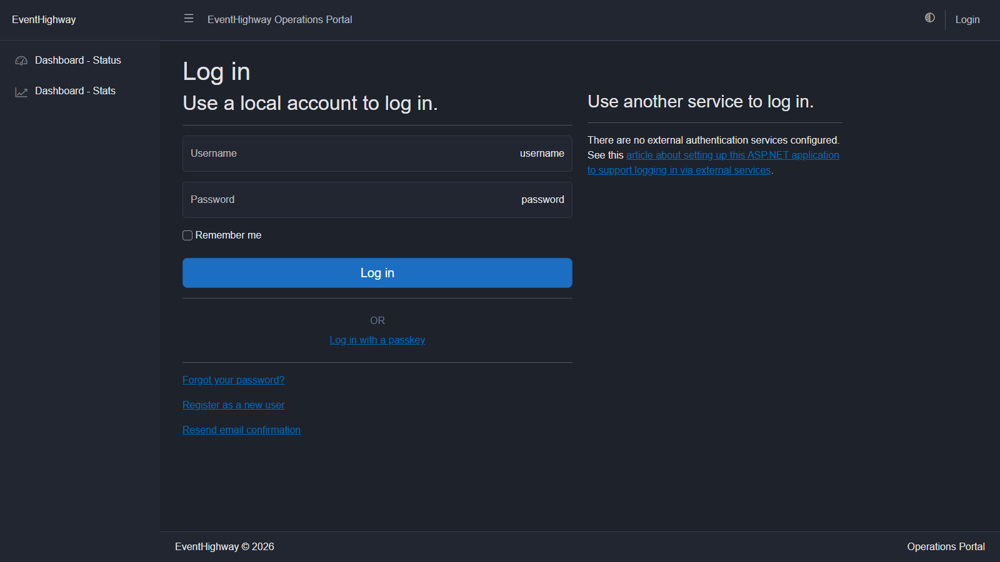

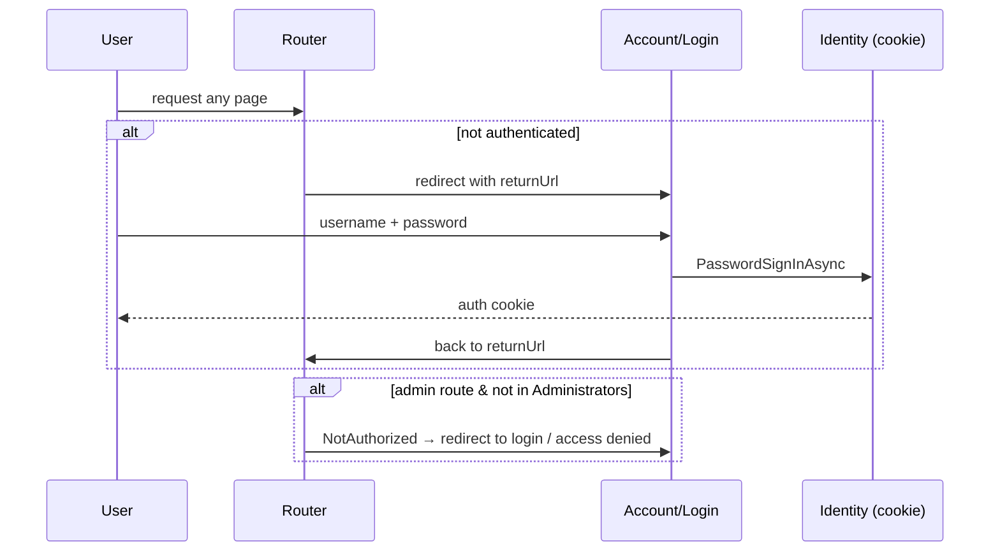
```mermaid
sequenceDiagram
    participant U as User
    participant R as Router
    participant L as Account/Login
    participant I as Identity (cookie)

    U->>R: request any page
    alt not authenticated
        R->>L: redirect with returnUrl
        U->>L: username + password
        L->>I: PasswordSignInAsync
        I-->>U: auth cookie
        L->>R: back to returnUrl
    end
    alt admin route & not in Administrators
        R->>L: NotAuthorized → redirect to login / access denied
    end
```

Once signed in, the header shows a user dropdown (Profile, Change Password, Logout) and the
light/dark/auto theme switcher (see [§11](#11-common-ui-building-blocks)).

---

## 2. Dashboard - Status

**Route:** `/` — visible to every signed-in user.

This is the "is everything OK?" page: a wall of **RAG (Red/Amber/Green) tiles** summarising the
health of the whole installation at a glance. It ignores time windows deliberately — it always
reports on the entire system as it stands right now.

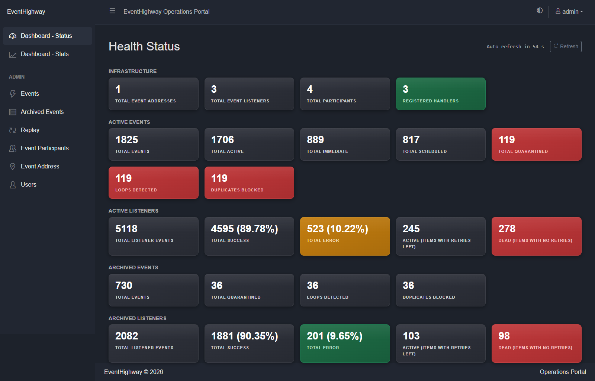

### 2.1 The tile groups

Tiles are grouped under headers, one group per health concern:

| Group | What its tiles report |
|---|---|
| **Infrastructure** | Total event addresses, event listeners, participants, and registered in-process handlers. |
| **Active Events** | Total events plus breakdowns: active, immediate, scheduled, quarantined, loops detected, duplicates blocked. |
| **Active Listeners** | Total listener events (delivery receipts), success/error counts with percentages, and retry posture — items with retries left vs **dead** items (no retries remaining). |
| **Archived Events** | The same event counters for everything already moved to the archive tables. |
| **Archived Listeners** | The same listener-event counters for the archive. |

### 2.2 RAG colours — how a tile gets its colour

The **thresholds live in EventHighway Core**, not in the portal. The Core health coordination
returns each check with a status string, and the portal maps it straight onto a tile style:

| Core status | Tile style |
|---|---|
| `Green` | Green gradient — healthy |
| `Amber` | Amber gradient — needs attention |
| `Red` | Red gradient — unhealthy |
| anything else | Neutral/dark — informational only (no judgement) |

So in the screenshot above: *Loops Detected* and *Dead items* burn red, the listener error rate
shows amber, and plain counters (totals) stay neutral because they are informational.

### 2.3 Auto-refresh

The page reloads itself every **60 seconds**; a countdown ("Auto-refresh in *n* s") shows when the
next refresh will happen, and a **Refresh** button forces one immediately (and resets the
countdown).

---

## 3. Dashboard - Stats

**Route:** `/stats` — visible to every signed-in user.

Where *Status* answers "is it OK now?", *Stats* answers "**what happened over a period?**". It is a
stack of six analytical panels, each scoped to a time window (Day / Week / Month / Year).

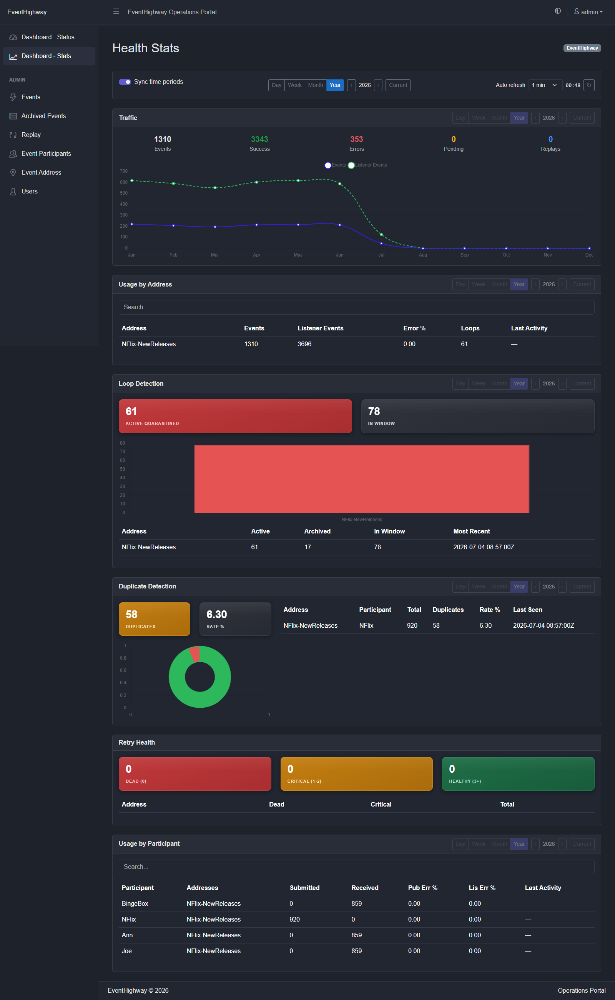

### 3.1 The control bar — periods, sync and auto-refresh

The bar at the top drives the whole page:

- **Sync time periods** (switch, on by default) — when on, one global period selector drives every
  panel and the panels' own selectors are disabled (dimmed). Turn it off and each panel gets its own
  independent period navigator, which keeps whatever window it was on when you unsynced.
- **Period navigator** — buttons for **Day / Week / Month / Year**, `‹` / `›` to step backwards and
  forwards, the current window label (e.g. `08 Jul 2026`, `07 Jul – 13 Jul 2026`, `Jul 2026`,
  `2026`), and a **Current** button to snap back to today. Weeks start on **Monday**; the `›`
  button disables rather than let you navigate into the future.
- **Auto refresh** — a dropdown: Off, 15 sec, 30 sec, 1 min (default), 2/5/10/15/30 min, with a
  `mm:ss` countdown and a `↻` force-refresh button. A refresh reloads **every** panel, whether
  synced or not.

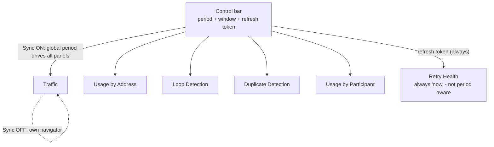
```mermaid
flowchart TD
    CB[Control bar<br/>period + window + refresh token]
    CB -- "Sync ON: global period drives all panels" --> P1[Traffic]
    CB -- " " --> P2[Usage by Address]
    CB -- " " --> P3[Loop Detection]
    CB -- " " --> P4[Duplicate Detection]
    CB -- " " --> P6[Usage by Participant]
    CB -- "refresh token (always)" --> P5[Retry Health<br/>always 'now' - not period aware]
    P1 -.->|Sync OFF: own navigator| P1
```

### 3.2 Traffic

Headline numbers for the window — Events, Success, Errors, Pending, Replays (colour-coded) — above
a **line chart** plotting Events vs Listener Events across the window (hours for a day, days for a
week/month, months for a year).

### 3.3 Usage by Address

A searchable, sortable, paged table of every event address: total events, listener events, error
percentage, loop count and last activity. Use it to spot which channel is doing the work and which
one is generating the errors.

### 3.4 Loop Detection

Two tiles — **Active Quarantined** (red) and **In Window** — a bar chart of loops per address for
the window, and a per-address table (active vs archived quarantined counts, in-window count, most
recent detection).

### 3.5 Duplicate Detection

Tiles for **Duplicates** detected and the overall duplicate **Rate %**, a doughnut chart of unique
vs duplicate events, and a per-address/per-participant table with totals, duplicate counts, rates
and last-seen timestamps.

### 3.6 Retry Health

The retry posture of failed deliveries, bucketed by **remaining retry attempts**:

| Bucket | Meaning | Tile colour |
|---|---|---|
| **Dead (0)** | No retries left — will never be retried; needs replay or investigation | Red |
| **Critical (1-2)** | Almost out of retries | Amber |
| **Healthy (3+)** | Plenty of retries left | Green |

Plus a bar chart of the full distribution (count by retries remaining) and a per-address breakdown.
This panel is **not** period-aware — retry state only makes sense "as of now" — but it still
reloads on every refresh tick.

### 3.7 Usage by Participant

A searchable table attributing traffic to participants: which addresses they use, events submitted,
listener events received, publisher and listener error rates, and last activity.

---

## 4. Events

**Route:** `/admin/events` — `Administrators` only.

### 4.1 The events list

Every live (unarchived) event on the highway, most recent first.

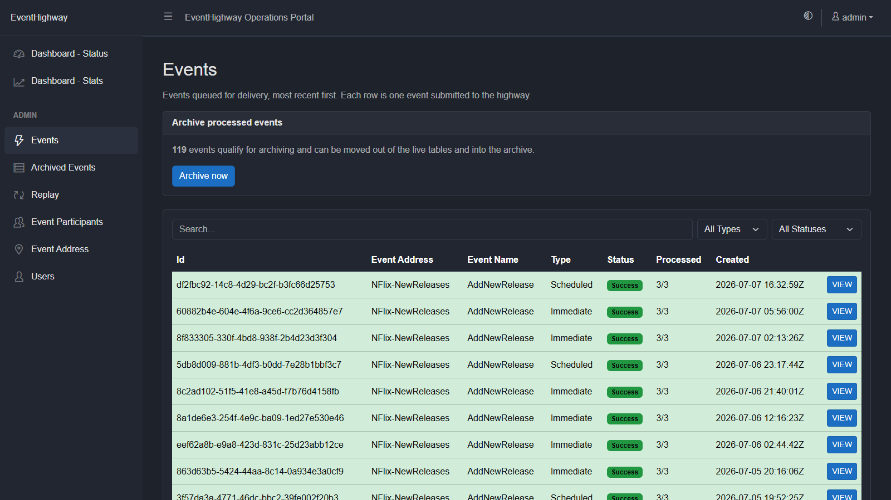

- **Columns:** Id, Event Address, Event Name, Type (Immediate/Scheduled), Status (badge),
  Processed (`n/m` listener events completed), Created.
- **Search** across all columns, plus two dropdown filters: **Type** (All / Immediate / Scheduled)
  and **Status** (All / Success / Partial Success / Error / Pending / Quarantined).
- **Row highlighting** tells you delivery health at a glance:

| Row colour | Condition (dispatch status) |
|---|---|
| 🟥 red (`table-danger`) | `Quarantined` or `Error` — nothing delivered, or the event was quarantined by loop/duplicate detection |
| 🟨 amber (`table-warning`) | `Partial Success` — some listeners succeeded, some failed |
| 🟩 green (`table-success`) | `Success` — every listener delivered |
| no colour | `Pending` / not yet dispatched |

- Each row has a **VIEW** button that opens the event's detail page.

### 4.2 Archiving processed events

The card above the table shows how many events currently **qualify for archiving** (fully
processed events past the archive age threshold) and an **Archive now** button that moves them —
and their listener events — out of the live tables into the archive (see
[Core design §3](../EventHighway.Core/V2/EventHighway.Core.V2.Design.md#3-archiving)). A success or
failure alert is shown and the list reloads.

### 4.3 Event details

**Route:** `/admin/events/{id}` — reached via **VIEW**.

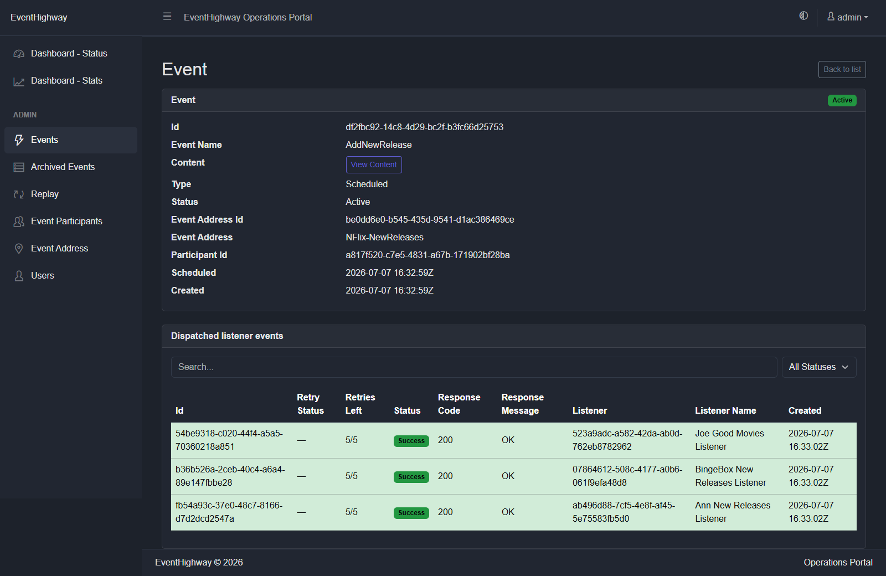

The top card shows the event itself: Id, name, type, status (badge: green `Active`, amber
`Quarantined`), the target address (id and name), the owning participant id, and the scheduled and
created timestamps. The **View Content** button opens a large scrollable modal with the event's
JSON payload pretty-printed (raw text if the content isn't JSON).

Below it, **Dispatched listener events** lists one row per delivery receipt (`ListenerEventV2`):

- **Columns:** Id, Retry Status, Retries Left (`remaining/allowed`), Status (badge), Response Code,
  Response Message, Listener id and name, Created.
- A **Status filter** (All / Pending / Success / Error / Replay).
- **Retry Status** uses the same buckets as the Retry Health panel: `—` while not in error,
  otherwise **Dead** (0 retries left, red badge), **Critical** (1–2, amber) or **Healthy** (3+,
  green).
- **Row highlighting:** green (`table-success`) for `Success`, red (`table-danger`) for `Error`,
  uncoloured otherwise.

This page is read-only — recovery actions live on the archive detail page ([§5.2](#52-archived-event-details--single-item-replay)) and the Replay page ([§6](#6-replay-bulk)).

---

## 5. Archived Events

**Route:** `/admin/event-archives` — `Administrators` only.

### 5.1 The archive list & purging

The archive mirror of the events list: everything that has been moved out of the live tables.

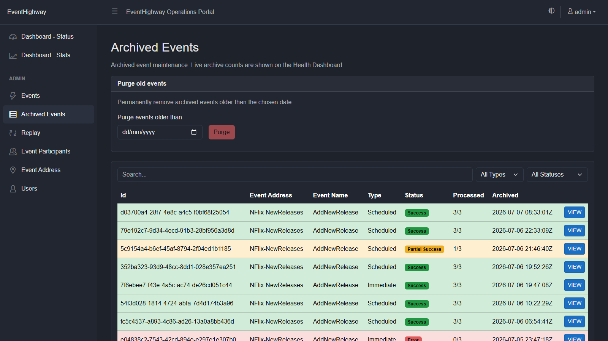

- **Columns:** Id, Event Address, Event Name, Type, Status (badge), Processed, **Archived** date.
- The same search, Type/Status filters and **row highlighting** as the live events list
  (red = quarantined/error, amber = partial success, green = success).
- The **Purge old events** card at the top permanently deletes archives older than a chosen date:
  pick a date, press **Purge** (disabled until a date is chosen), and confirm the dialog —
  *"Purge all archived events created before {date}? This cannot be undone."*

### 5.2 Archived event details & single-item replay

**Route:** `/admin/event-archives/{id}`.

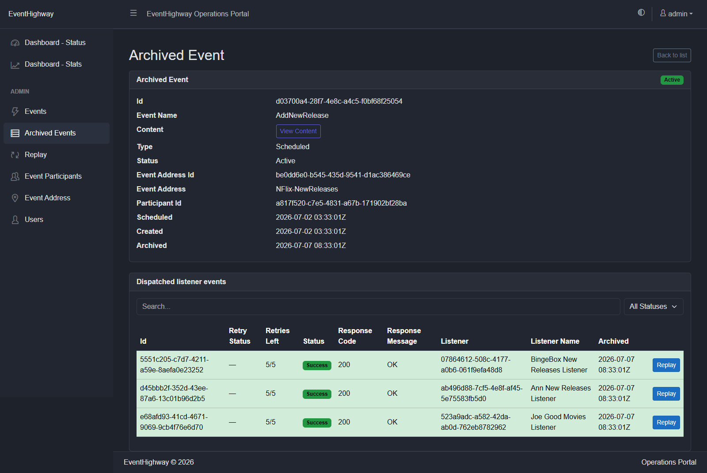

Identical layout to the live event detail — event card (plus an **Archived** date), the JSON
content modal, and the archived listener-event table with the same columns, status filter, retry
status badges and green/red row highlighting.

The difference: each archived listener event row has a **Replay** button. This is the *targeted*
replay — re-deliver exactly one (event × listener) pair. It opens a confirm dialog with a warning
worth reading twice:

> *"Are you sure you want to replay this item? Be aware that replayed items will not be subject to
> loop detection!"*

Confirming queues the replay and shows "Replay queued for {listener}." — the Core replay machinery
takes it from there (a fresh `Replay`-status listener event is created on the live side and
dispatched; see
[Core design §4](../EventHighway.Core/V2/EventHighway.Core.V2.Design.md#4-replay)).

---

## 6. Replay (bulk)

**Route:** `/admin/replay` — `Administrators` only.

Where §5.2 replays a single delivery, this page replays **swathes** of the archive, scoped by up to
three optional dimensions. Leaving a dimension unrestricted includes everything.

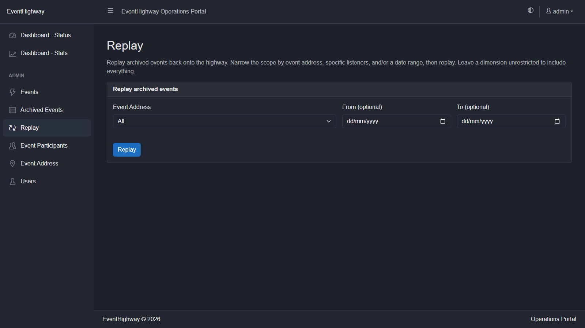

The workflow:

1. **Event Address** — pick one address, or *All*.
2. **Listeners** (appears once an address is chosen) — optionally narrow to specific listeners on
   that address: pick from the *Add Listener* dropdown, added listeners show in a list with a
   *Remove* button. No listeners selected means *all* listeners on the address are replayed.
3. **From / To dates** (optional) — bound the archive window to replay.
4. Press **Replay**. The request is submitted and processed synchronously; on completion the page
   shows *"Replay requested and replayed events processed."*

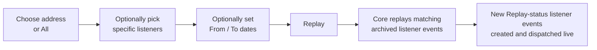
```mermaid
flowchart LR
    A[Choose address<br/>or All] --> B[Optionally pick<br/>specific listeners]
    B --> C[Optionally set<br/>From / To dates]
    C --> D[Replay]
    D --> E[Core replays matching<br/>archived listener events]
    E --> F[New Replay-status listener events<br/>created and dispatched live]
```

> **Note:** like targeted replay, bulk replay bypasses loop detection — use the date range and
> listener scoping to keep the blast radius deliberate.

---

## 7. Event Participants

**Route:** `/admin/participants` — `Administrators` only.

Participants are the external parties (publishers/subscribers) that own events and listeners, and
authenticate to the highway with **secrets**.

### 7.1 The participants list

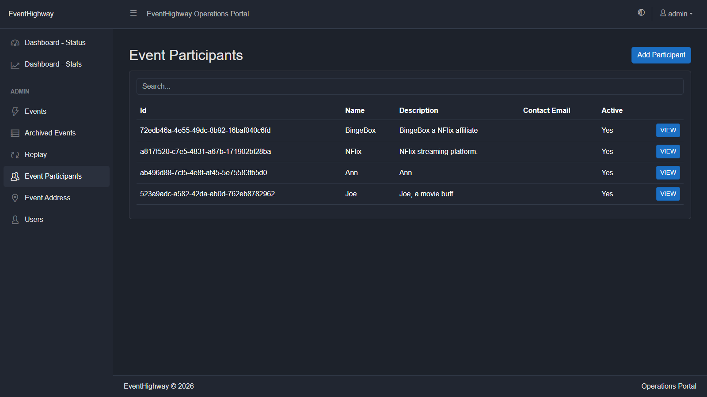

- **Columns:** Id, Name, Description, Contact Email, Active (Yes/No). Searchable, sortable, paged.
- **Add Participant** (top right) opens a modal: Name, Description, Contact Email, Contact Phone
  and an Active switch (on by default).
- **VIEW** opens the participant's detail page.

### 7.2 Participant details & secrets

**Route:** `/admin/participants/{id}`.

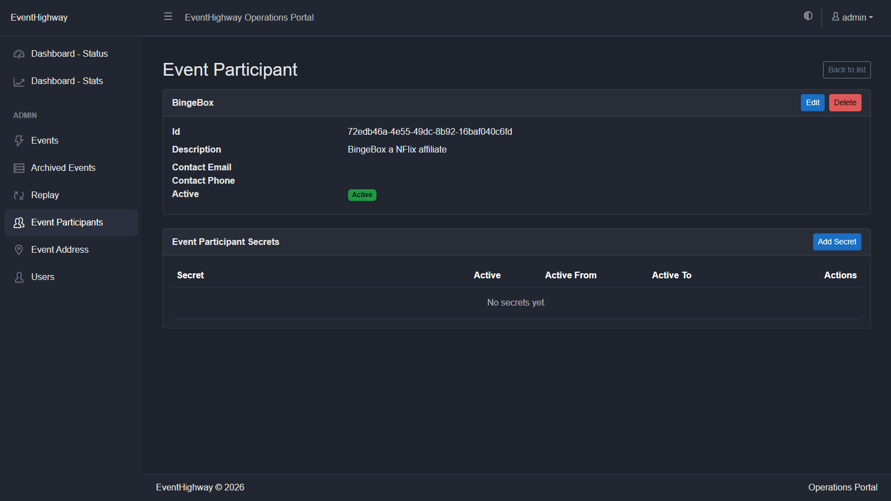

The header card shows the participant with **Edit** (same modal as create) and **Delete** buttons.
Delete asks for confirmation — *"Deleting this participant is permanent and cannot be undone."*

Below it, the **Event Participant Secrets** card manages the participant's credentials:

- **Columns:** Secret, Active, Active From, Active To, Actions.
- Secret values are **masked** (••••••••) with an eye toggle to reveal/hide each one.
- **Add Secret** opens a modal (Secret value, Active From, Active To, Active switch).
- **Edit** switches the row to inline editing — toggle Active, adjust the validity window — with
  Save/Delete; deleting a secret asks for confirmation (permanent).
- Secrets have validity windows (`Active From` / `Active To`) so keys can be rotated: introduce the
  new secret before the old one lapses, then revoke the old one.

At the bottom, an **Associated Users** card lists the portal users linked to this participant
(Username, Email) with a **Remove** button each, and a **Find User** lookup (by username or email)
to associate another user. This is the reverse of the *Event Participants* card on the user detail
page ([§9.2](#92-user-details)); both edit the same association store. See
[§13](#13-my-account--participant-management).

---

## 8. Event Addresses

**Route:** `/admin/event-addresses` — `Administrators` only.

Addresses are the named channels everything else hangs off; listeners are the subscriptions
registered on them.

### 8.1 The addresses list

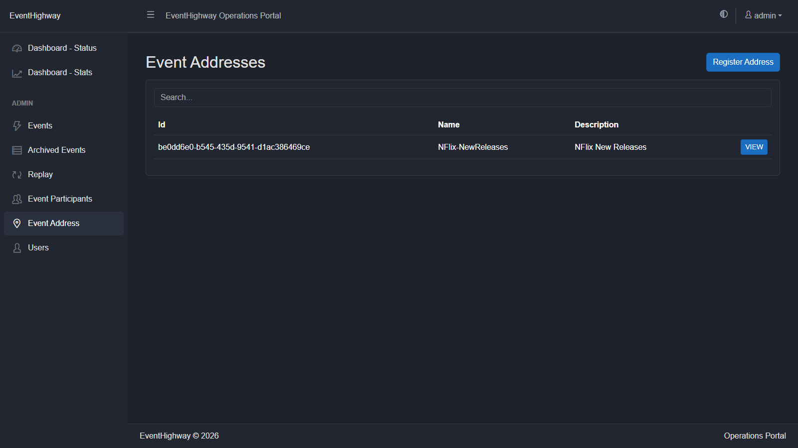

- **Columns:** Id, Name, Description. Searchable.
- **Register Address** opens a modal (Name, Description).
- **VIEW** opens the address detail page.

### 8.2 Address details & listeners

**Route:** `/admin/event-addresses/{id}`.

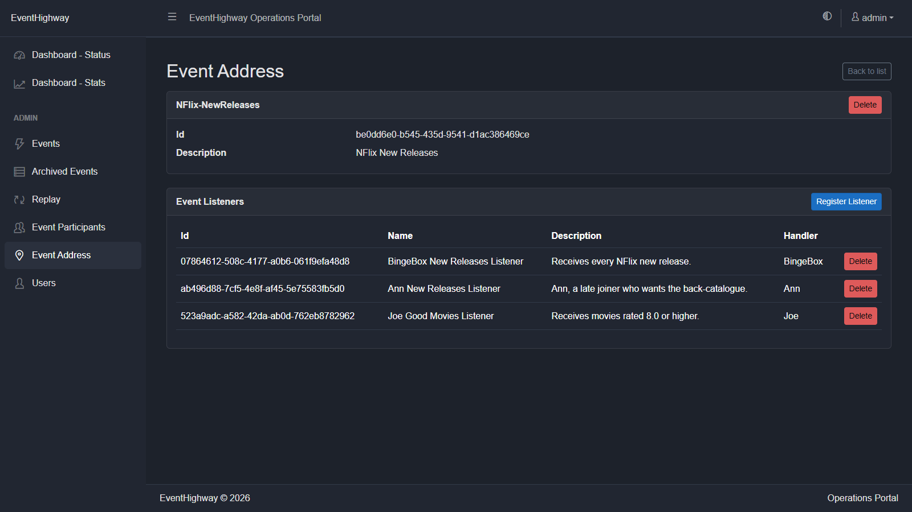

The header card shows the address with a **Delete** button (confirmation dialog; deletion fails
with a helpful message if the address still has events or listeners hanging off it).

The **Listeners** card manages subscriptions on this address:

- **Table columns:** Id, Name, Description, Handler (the friendly handler name).
- **Register Listener** opens a modal capturing: Name, Description, **Handler Id** (must be a valid
  GUID — this is the id the consuming application registers its in-process handler under), Handler
  Name, an optional owning **Participant**, and the optional **Promoted Properties** and
  **Filter Criteria** used for content-based filtering (see
  [Core design §1.3.2](../EventHighway.Core/V2/EventHighway.Core.V2.Design.md#132-filtered-listeners--match-vs-no-match)).
- Each listener row has a **Delete** button with its own confirmation dialog.

---

## 9. Users

**Route:** `/admin/users` — `Administrators` only.

This section manages **portal accounts** (the Identity store), not EventHighway participants.

### 9.1 The users list

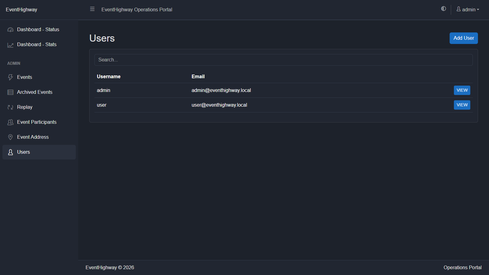

- **Columns:** Username, Email.
- **Add User** opens a modal: Username, Email, Password.
- **VIEW** opens the user detail page.

### 9.2 User details

**Route:** `/admin/users/{id}` — the richest admin page.

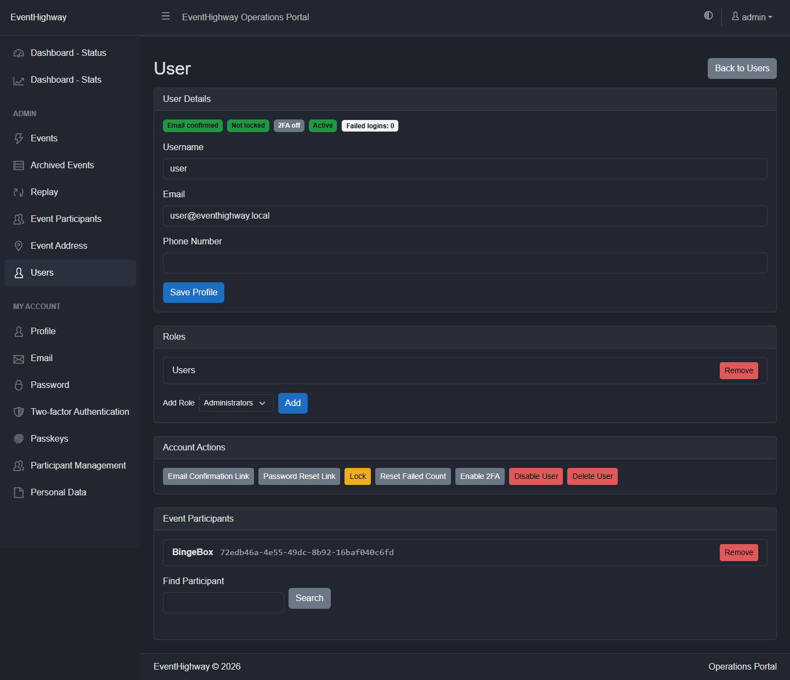

Three cards:

1. **User Details** — status badges across the top (Email confirmed, Locked out, 2FA on/off,
   Active/Disabled, Failed logins count) and editable Username / Email / Phone Number with a
   **Save Profile** button.
2. **Roles** — the user's current roles, each with a **Remove** button, and an **Add Role**
   dropdown (Administrators / Users). The portal protects itself: *the last administrator cannot be
   removed from the role, locked out, disabled or deleted.*
3. **Account Actions** — one-click administrative operations:
   - **Confirm Email** (when unconfirmed) / **Email Confirmation Link** — generates the tokenised
     confirmation URL into a copyable box (the portal has no outbound email, so links are handed
     over manually).
   - **Password Reset Link** — same idea for password resets.
   - **Lock / Unlock** and **Reset Failed Count** — lockout management.
   - **Enable / Disable 2FA**.
   - **Enable / Disable User** — the soft-delete: a disabled user cannot sign in but keeps their
     history.
   - **Delete User** — hard delete behind a modal that recommends disabling instead.
4. **Event Participants** — the participants this user may self-service. Each row shows the
   participant name and id with a **Remove** button; a **Find Participant** lookup (by id or name)
   associates another. Deleting the user cascades these associations away automatically. This is
   the reverse of the *Associated Users* card on the participant detail page
   ([§7.2](#72-participant-details--secrets)) and drives the self-service surface in
   [§13](#13-my-account--participant-management).

---

## 10. Row highlighting reference

All tables use Bootstrap contextual row classes, applied per row by the same rules everywhere so a
colour always means the same thing:

| Table | Row turns red (`table-danger`) | Amber (`table-warning`) | Green (`table-success`) |
|---|---|---|---|
| **Events list** ([§4.1](#41-the-events-list)) | Status `Quarantined` or `Error` | `Partial Success` | `Success` |
| **Archived events list** ([§5.1](#51-the-archive-list--purging)) | Status `Quarantined` or `Error` | `Partial Success` | `Success` |
| **Event detail — listener events** ([§4.3](#43-event-details)) | Status `Error` | — | `Success` |
| **Archive detail — listener events** ([§5.2](#52-archived-event-details--single-item-replay)) | Status `Error` | — | `Success` |

Rows in any other state (`Pending`, `Replay`, not yet dispatched) stay uncoloured.

Two related colour systems appear *inside* cells, distinct from row colour:

- **Status badges:** `Success` green, `Partial Success` amber, `Error`/`Quarantined` red,
  anything else grey.
- **Retry Status badges** (listener-event tables): `Dead` red, `Critical` amber, `Healthy` green —
  the same 0 / 1–2 / 3+ remaining-retries buckets as the Retry Health panel
  ([§3.6](#36-retry-health)).

---

## 11. Common UI building blocks

The whole portal is assembled from a small set of shared CoreUI-styled components:

- **DataTable** — every list. Free-text **search** (case-insensitive, across all columns),
  click-to-**sort** on any column (toggle asc/desc with an arrow indicator), **paging** (10 rows
  per page, pager appears only when needed), plus slots for extra filter dropdowns, per-row action
  buttons, templated cells (badges) and the `RowClass` highlight function from
  [§10](#10-row-highlighting-reference).
- **Modal** — all create/edit forms and the JSON content viewers (the content viewer uses the extra
  large, scrollable variant).
- **ConfirmDialog** — every destructive or dangerous action (purge, delete participant / secret /
  address / listener / user, single-item replay) goes through an explicit confirmation with a
  danger-styled confirm button.
- **Cards, form controls, buttons, spinner** — consistent chrome for every page; a `Spinner` shows
  while a page loads and a dismissible alert reports success/failure of any action.
- **Theme switcher** — the header hosts a Light / Dark / Auto colour-mode dropdown; the choice is
  persisted in the browser. (The screenshots in this document use dark mode.)
- **Layout** — fixed dark sidebar with the role-aware menu ([§1.2](#12-what-a-read-only-user-sees)),
  header with the user dropdown, footer, and Blazor's reconnect modal for dropped circuits.

---

## 12. How the portal talks to EventHighway

Pages never touch the Core client directly. Each page injects a **view service** which shapes Core
entities into view models and wraps every call in a `TryCatch` exception pipeline with logging. View
services call a single **EventHighway broker**, which routes every call through a
**client provider** that (a) builds the Core `IClientV2` once, lazily, retrying on cold-start
failures, and (b) **serialises all access behind a semaphore** — the Core client wraps one EF
`DbContext`, which is not thread-safe, while Blazor happily renders the six dashboard panels
concurrently. Identity/user administration bypasses all of this and works against the separate
`EventHighway.Security` database via its own broker.

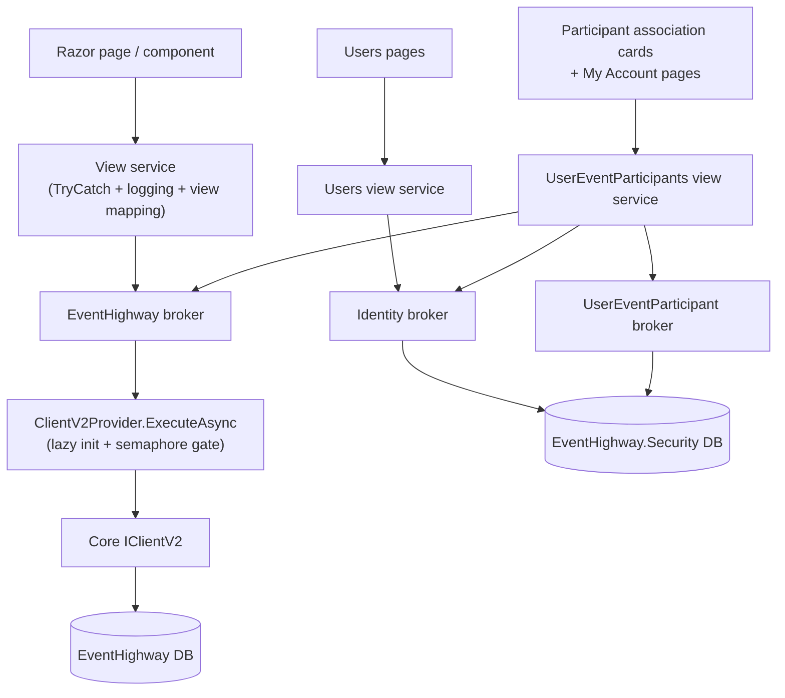
```mermaid
flowchart TD
    Page[Razor page / component] --> VS["View service<br/>(TryCatch + logging + view mapping)"]
    VS --> B[EventHighway broker]
    B --> CP["ClientV2Provider.ExecuteAsync<br/>(lazy init + semaphore gate)"]
    CP --> C[Core IClientV2]
    C --> DB[(EventHighway DB)]

    PageU[Users pages] --> VSU[Users view service] --> IB[Identity broker] --> SDB[(EventHighway.Security DB)]
    PageA[Participant association cards<br/>+ My Account pages] --> VSA[UserEventParticipants view service]
    VSA --> UEB[UserEventParticipant broker] --> SDB
    VSA --> IB
    VSA --> B
```

The `UserEventParticipants` view service is the one place that spans both databases: it stores the
association row in the security database (via its own broker) while resolving participant names from
the Core database (via the EventHighway broker) and user names from Identity. There is no
cross-database foreign key — the association row keeps only the participant's id.

Health data specifically flows through the Core health sub-clients — status (RAG), traffic,
address, loop, duplicate, retry and participant — one per dashboard panel.

---

## 13. My Account & Participant Management

The portal is both an operator console *and* a light self-service surface for the external parties
on the highway. A portal user can be **associated with one or more Event Participants**; that
association is the sole key that unlocks a scoped, read-only-plus-secrets view of those
participants — without widening the `Administrators` surface at all.

### 13.1 The association

Associations live in the `EventHighway.Security` database as a `UserEventParticipants` table
(`UserId` → `AspNetUsers`, cascade-delete; `EventParticipantId` — a plain id, since the participant
lives in a different database; a unique `UserId + EventParticipantId` index). Administrators manage
them from **both directions**:

- **User → participants**: the *Event Participants* card on the user detail page
  ([§9.2](#92-user-details)).
- **Participant → users**: the *Associated Users* card on the participant detail page
  ([§7.2](#72-participant-details--secrets)).

Both edit the same rows, so an association added on one page appears on the other.

### 13.2 Self-service pages

Associated users reach their participants through **My Account → Participant Management**
(`/my/participants`), outside the Identity `/Account` area so the pages are fully interactive:

- **List** (`/my/participants`) — the participants this user is associated with, as a read-only
  table with a **View** button. No *Add Participant* button. With no associations it shows:
  *"You do not currently have any Event Participant Associations. Contact Support if you think this
  is incorrect."*
- **Detail** (`/my/participants/{id}`) — the participant profile **read-only** (no Edit, no Delete,
  no edit modal) plus the full **secrets** card: add, reveal/hide, inline-edit and delete secrets,
  exactly as [§7.2](#72-participant-details--secrets).

### 13.3 The authorization model — association is the only key

- The `/my/*` pages carry only `[Authorize]` (authenticated), **no role filter**.
- Access is decided **solely** by the association, checked server-side: the list shows only
  associated participants, and the detail page verifies the association *before fetching any
  participant or secret data* — a direct URL to an unassociated participant renders *"You do not
  have access to this Event Participant…"* and loads nothing.
- Every secret mutation **re-verifies** the association first, so revoking access takes effect
  immediately, even mid-session on a live circuit.
- **Administrator rights grant no bypass here.** An admin with no association sees the empty state
  like anyone else; admins manage participants through `/admin/participants` instead.

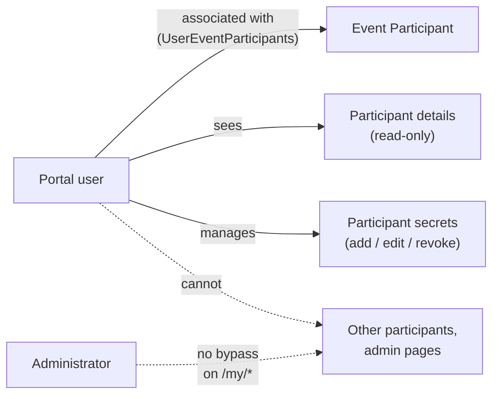
```mermaid
flowchart LR
    U[Portal user] -- "associated with<br/>(UserEventParticipants)" --> P[Event Participant]
    U -- sees --> RO["Participant details<br/>(read-only)"]
    U -- manages --> S["Participant secrets<br/>(add / edit / revoke)"]
    U -. cannot .-> O[Other participants,<br/>admin pages]
    A[Administrator] -. "no bypass<br/>on /my/*" .-> O
```
