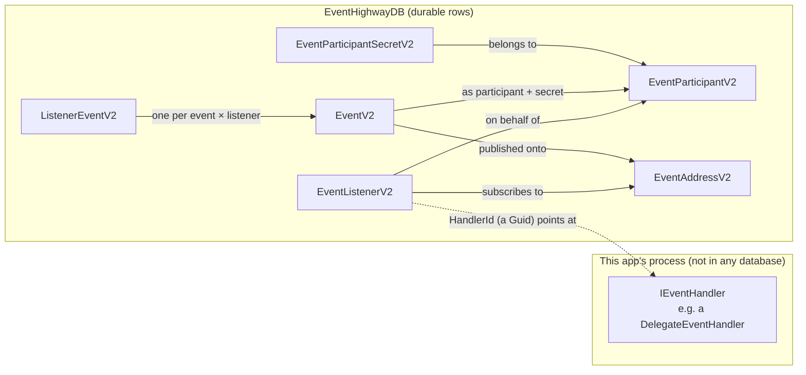
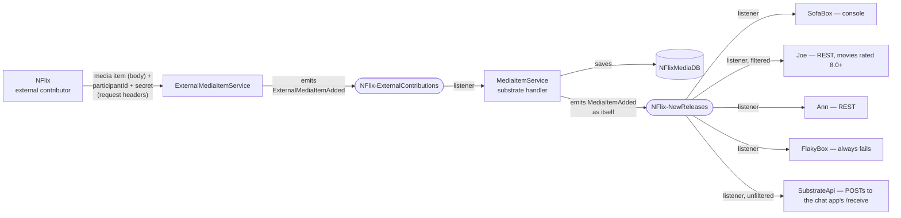
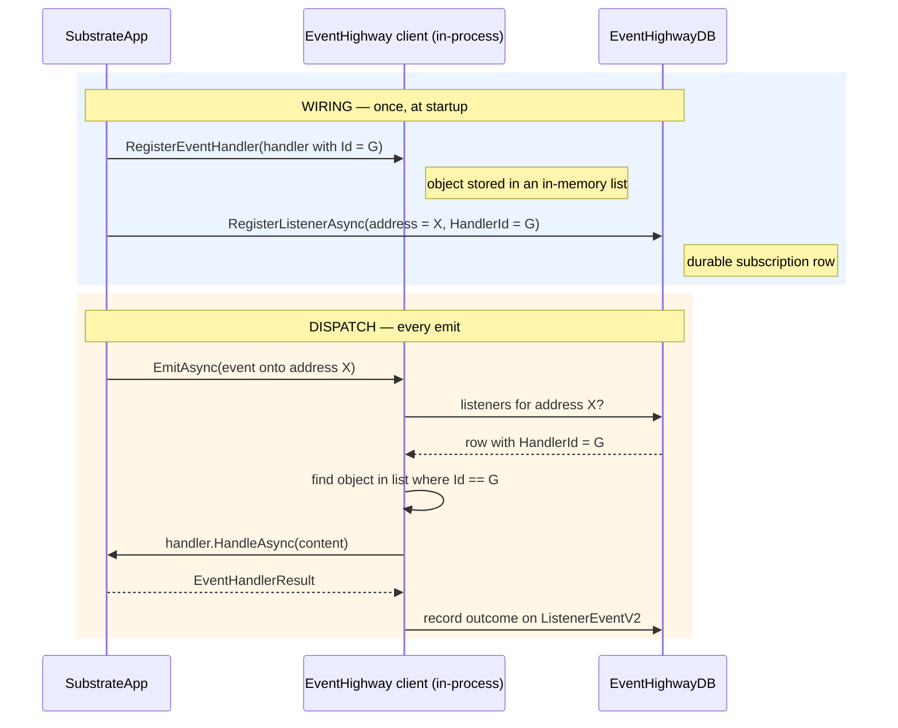
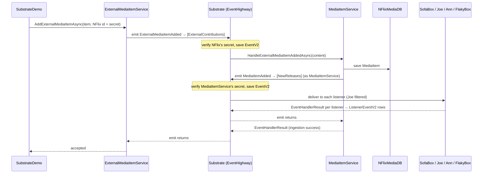

# EventHighway Client V2 — The NFlix Media Catalogue (Substrate Sample)

This console app simulates a small ecosystem built around **EventHighway** (referred to
throughout as *the substrate* — the shared event backbone every party talks through):

- **NFlix** — an external streaming platform that contributes media items from outside.
- **MediaItemService** — an internal catalogue service that owns its own database
  (`NFlixMediaDB`), ingests contributions, and announces every catalogue change.
- **SofaBox, Joe, Ann, FlakyBox** — downstream affiliates who want to hear about new
  releases (console logging, REST forwarding, and one endpoint that is always down).
- **SubstrateApi** — the [chat app](../EventHighway.ClientV2.SubstrateApi/README.md), which
  subscribes to *everything*, unfiltered. Start it alongside this console and every release
  this app dispatches shows up on its UI, live.

Nobody calls anybody directly. Every hop goes through the substrate, which stores its own
state (participants, addresses, listeners, events, deliveries) in `EventHighwayDB`.

For the simpler single-address walkthrough (scheduling, archiving, replay), see the
[`EventHighway.ClientV2.BasicApp`](../EventHighway.ClientV2.BasicApp/README.md) sample.
This document is self-contained: it explains the setup piece by piece, then follows one
media item end to end.

---

## The building blocks

Six concepts carry the whole sample. The first five live as rows in `EventHighwayDB`;
the last one is plain C# code in this app's process:

| Concept | What it is | Think of it as |
|---|---|---|
| `EventParticipantV2` | An identity: who publishes or receives | A person in your contacts |
| `EventParticipantSecretV2` | A credential attached to a participant | That person's password |
| `EventAddressV2` | A named channel events are published onto | A topic / mailbox |
| `EventListenerV2` | A durable subscription: "events on address X go to handler Y" | A mail-forwarding rule |
| `EventV2` / `ListenerEventV2` | One published event / one delivery attempt to one listener | The letter / the delivery receipt |
| `IEventHandler` | In-process code the substrate calls with the event content | The person who opens the letter |



The dotted line is the one everything hinges on: a listener **row** cannot contain code,
so it stores a `HandlerId` Guid, and at dispatch time the substrate matches that Guid
against the handler **objects** this app registered in memory. Step 4 below covers it
carefully.

---

## The story at a glance

Two addresses, chained together by `MediaItemService`:



External contributions arrive with credentials on the intake address; the catalogue
service ingests them, persists them, and re-announces them on the releases address under
its **own** identity, where the affiliates pick them up.

---

## One seam to the substrate

Application code never touches `EventHighwayClient` directly. Everything goes through one
broker interface, [`IEventSubstrateBroker`](Brokers/EventSubstrates/IEventSubstrateBroker.cs),
whose implementation constructs the client and forwards each call
([`EventSubstrateBroker`](Brokers/EventSubstrates/EventSubstrateBroker.cs), split into
one partial file per concern):

```csharp
public EventSubstrateBroker(string connectionString, EventHighwayConfiguration configuration) =>
    this.eventHighwayClient =
        new EventHighwayClient(new SqlServerStorageBrokerProvider(connectionString), configuration);

public ValueTask<EventV2> SubmitEventAsync(EventV2 eventV2, CancellationToken cancellationToken = default) =>
    this.eventHighwayClient.V2.EventV2Client.SubmitEventV2Async(eventV2, cancellationToken);
```

This is the standard "broker wraps the external dependency" pattern: the rest of the app
reads as plain intent (`AddParticipantAsync`, `RegisterListenerAsync`, `EmitAsync`), and
exactly one folder knows EventHighway exists.

---

## Part 1 — Setup, step by step

All setup lives in [`SubstrateDemo.Setup.cs`](Demos/SubstrateDemo.Setup.cs) and runs once
at startup, in this order: participants → addresses → listeners. Every row uses a fixed
Guid from [`SeedIdentifiers.cs`](SeedIdentifiers.cs), so re-running the app finds the
existing rows instead of inserting duplicates.

### Step 1 — Participants and their secrets

A **participant** is an identity row — nothing more. Anyone who appears anywhere in the
system (as a publisher or as a subscriber) gets one:

```csharp
this.nflix =
    await this.eventSubstrateBroker.AddParticipantAsync(
        new EventParticipantV2
        {
            Id = SeedIdentifiers.NFlixParticipant,
            Name = "NFlix",
            Description = "NFlix streaming platform.",
            IsActive = true,
            ...
        });
```

A **participant secret** is a credential attached to a participant. It is only needed for
**publishing**: every event submitted to the substrate carries a participant id *and* a
secret value, and the substrate core verifies the pair before accepting the event. Wrong
or missing credentials → the event is rejected.

```csharp
await this.eventSubstrateBroker.AddParticipantSecretAsync(
    new EventParticipantSecretV2
    {
        Id = SeedIdentifiers.NFlixSecret,
        Secret = SeedIdentifiers.NFlixSecretValue,   // "NFlix" — what NFlix presents when publishing
        EventParticipantV2Id = this.nflix.Id,        // ← the secret belongs to this participant
        IsActive = true,
        ...
    });
```

Who gets a secret here tells you who publishes:

| Participant | Secret? | Why |
|---|---|---|
| NFlix | ✔ | Publishes contributions onto the intake address |
| MediaItemService | ✔ | Publishes `MediaItemAdded/Updated/Deleted` onto the releases address |
| SubstrateApi | ✔ | Listens here, but *also* publishes — the chat app submits media items under this identity through its own `/submit` endpoint |
| SofaBox, Joe, Ann, FlakyBox | ✘ | They only *receive* — listening requires no credential |

### Step 2 — Addresses

An **address** is a named channel — the thing events are published *onto* and listeners
subscribe *to*. Registration is get-or-create, so it is safe to run repeatedly:

```csharp
this.externalContributions =
    await this.eventSubstrateBroker.RetrieveOrRegisterAddressAsync(
        new EventAddressV2
        {
            Id = SeedIdentifiers.NFlixExternalContributionsAddress,
            Name = "NFlix-ExternalContributions",
            Description = "Public intake for externally contributed media items.",
            ...
        });
```

One subtlety worth knowing: the address row itself has **no owner column** — no
participant id on `EventAddressV2`. "This is NFlix's address" is a naming convention,
not a database constraint. The participant links live on the two sides of the address
instead: each **event** records which participant published it (with a verified secret),
and each **listener** records which participant it receives on behalf of. Any participant
with a valid secret may publish to any address.

The sample registers two addresses:

- **`NFlix-ExternalContributions`** — the authenticated public intake.
- **`NFlix-NewReleases`** — where the catalogue announces changes and affiliates listen.

### Step 3 — Listeners: durable subscriptions

A **listener** is a database row that wires an address to a handler. It contains no code;
it says *"when an event lands on this address, run the handler with this id, on behalf of
this participant"*:

```csharp
await this.eventSubstrateBroker.RegisterListenerAsync(
    new EventListenerV2
    {
        Id = SeedIdentifiers.MediaItemServiceContributionsListener,
        Name = "MediaItemService Contributions Listener",
        Description = "Ingests accepted external contributions into the media catalogue.",
        HandlerId = ingestionHandler.Id,                    // ← which code to run (a Guid, see Step 4)
        HandlerName = ingestionHandler.Name,
        EventAddressV2Id = this.externalContributions.Id,   // ← what to listen to
        EventParticipantV2Id = this.mediaService.Id,        // ← on whose behalf
        ...
    });
```

Six listeners are registered:

| Listener | Address | Handler | Extras |
|---|---|---|---|
| MediaItemService Contributions | ExternalContributions | MediaItemService's substrate handler | — |
| SofaBox New Releases | NewReleases | SofaBox (console) | — |
| Joe Good Movies | NewReleases | Joe (REST) | Filter: movies rated 8.0+ |
| Ann New Releases | NewReleases | Ann (REST) | — |
| FlakyBox New Releases | NewReleases | FlakyBox (always fails) | Seeds failure data |
| SubstrateApi New Releases | NewReleases | SubstrateApi (REST, real localhost) | No filter — everything reaches the chat |

Joe's row shows the two optional dispatch features. `PromotedProperties` lifts named
values out of the event's JSON content, and `FilterCriteria` is an expression evaluated
against them — if it returns `false`, the substrate skips delivery for this listener:

```csharp
PromotedProperties = "Title,Type,Rating",
FilterCriteria = "meta(\"Type\") == \"Movie\" && double.Parse(meta(\"Rating\")) >= 8.0",
```

Note that `MediaItemService` **listens only on the contributions address**. It publishes
to the releases address but has no listener there — otherwise it would receive its own
announcements back.

### Step 4 — Handlers: the code that actually runs

This is the part that trips people up, so we take it slowly.

#### 4.1 The contract: `IEventHandler`

The substrate does not know what "ingest a media item" or "call Joe's API" means. All it
knows is this interface (from `EventHighway.Abstractions`):

```csharp
public interface IEventHandler
{
    Guid Id { get; }        // the Guid that listener rows point at
    string Name { get; }    // unique display name per registered handler

    ValueTask<EventHandlerResult> HandleAsync(
        string content,                              // the event payload, as a JSON string
        CancellationToken cancellationToken = default);
}
```

At delivery time the substrate calls `HandleAsync` with the event content and records the
returned `EventHandlerResult` (success flag, response text, response code) on the
delivery record.

#### 4.2 You do not have to implement it yourself: `DelegateEventHandler`

You *could* write `class MyHandler : IEventHandler` and implement all three members. But
the `EventHighway.EventHandlers` project ships a ready-made implementation —
`DelegateEventHandler` — that lets you supply the three pieces as constructor arguments
instead of writing a class:

```csharp
new DelegateEventHandler(
    id,        // Guid       → becomes .Id
    handler,   // a function → becomes the body of .HandleAsync
    name);     // string     → becomes .Name
```

The `handler` argument's type is:

```csharp
Func<string, CancellationToken, ValueTask<EventHandlerResult>>
```

Read that as: *"a variable that holds a method — give it the content string and a
cancellation token, get back an `EventHandlerResult`"*. Any method or lambda with that
shape fits. SofaBox is the simplest example
([`MediaEventHandlers.cs`](Infrastructure/MediaEventHandlers.cs)) — its whole behaviour
is one lambda:

```csharp
this.SofaBox = new DelegateEventHandler(
    SeedIdentifiers.SofaBoxHandler,                 // stable Guid — listener rows reference this
    (content, cancellationToken) =>                  // the "method in a variable"
    {
        MediaItem item = MediaItemSerializer.Deserialize(content);
        Console.WriteLine($"[SofaBox] New Release - {item.Title} ...");
        return ValueTask.FromResult(new EventHandlerResult { IsSuccess = true, ... });
    },
    name: "SofaBox");
```

So: **one shared class, one instance per subscription.** SofaBox, Joe, Ann, FlakyBox,
SubstrateApi and the catalogue's ingestion handler are six *instances* of
`DelegateEventHandler`, each holding its own Guid, its own name, and its own function. No
new handler classes are written anywhere in this app — even Joe's function is not written
here: it comes from the packaged delegate client library
([`EventHighway.EventHandlers.Delegates.JoesRestApi`](../EventHighway.EventHandlers.Delegates.JoesRestApi/README.md)),
whose exposed `PostToJoesRestApiAsync` method matches the delegate signature and POSTs
the event content to Joe's REST API using the url and secret from `appsettings.json`.

SubstrateApi's handler is that *same library again*, constructed against a second
configuration section:

```csharp
new JoesRestApiDelegateClient(configuration, sectionName: "SubstrateApi")
```

Joe's section points at the WireMock stand-in; SubstrateApi's points at
`http://localhost:5150/receive` — a real endpoint, on a real app, that you can watch. One
delegate client library, two downstreams, and nothing in the delivery path knows the
difference.

Two rules about the Guid, because everything in Step 3 joins on it:

- It must be **stable** — listener rows persist across runs, so a handler created with
  `Guid.NewGuid()` would never match its listener again after a restart. That is why the
  ids come from `SeedIdentifiers`.
- It must be **registered in-process** at runtime for dispatch to find it (next section).

#### 4.3 The catalogue's own subscription: the `.Substrate.cs` partials

`MediaItemService` is a normal foundation service (validate → store → emit). Its
subscription lives in a dedicated partial file, so the eventing face of the service stays
separate from its CRUD face — the same way `.Validations.cs` and `.Exceptions.cs`
separate theirs. (A partial class is one class whose source is split across files; the
compiler merges them.)

[`MediaItemService.Substrate.cs`](Services/Foundations/MediaItems/MediaItemService.Substrate.cs):

```csharp
internal partial class MediaItemService
{
    private DelegateEventHandler externalMediaItemAddedEventHandler;

    public IEventHandler ExternalMediaItemAddedEventHandler =>
        this.externalMediaItemAddedEventHandler ??= new DelegateEventHandler(
            SeedIdentifiers.MediaItemServiceHandler,
            HandleExternalMediaItemAddedAsync,          // ← the service's own private method
            name: "MediaItemService");

    private async ValueTask<EventHandlerResult> HandleExternalMediaItemAddedAsync(
        string content,
        CancellationToken cancellationToken)
    {
        MediaItem mediaItem =
            await this.jsonSerializationBroker.DeserializeAsync<MediaItem>(content);

        MediaItem addedMediaItem =
            await AddMediaItemAsync(mediaItem);         // ← straight into the foundation logic

        return new EventHandlerResult { IsSuccess = true, ... };
        // ...validation failures map to 400, anything else to 500
    }
}
```

Two details to read slowly:

- **`HandleExternalMediaItemAddedAsync` is passed without parentheses.** That is not a
  call — it hands the *method itself* to the `DelegateEventHandler`, which stores it and
  invokes it later, on this same service instance. This is how "a method on
  MediaItemService" becomes "the body of an `IEventHandler`".
- **`??=` means "create once."** The first read of the property constructs the
  `DelegateEventHandler`; every later read returns the same instance, so the Guid, the
  name, and the object identity stay consistent everywhere it is used.

The property is also added to the service's **interface** via a matching partial,
[`IMediaItemService.Substrate.cs`](Services/Foundations/MediaItems/IMediaItemService.Substrate.cs):

```csharp
public partial interface IMediaItemService
{
    IEventHandler ExternalMediaItemAddedEventHandler { get; }
}
```

This matters for the next section: the wiring code only ever sees `IMediaItemService`
(the interface it resolves from the DI container), so the handler has to be reachable
*through the interface*. It also gives future subscriptions an obvious home — one more
property per event, same pattern.

#### 4.4 Where the handler's logic lives: in your domain, or in a packaged delegate client library

Sections 4.2 and 4.3 showed the mechanics; this one is about a design choice those
mechanics leave open. A `DelegateEventHandler` only needs *a function* — it does not care
where that function's logic lives. This sample deliberately shows both homes:

| Home | Example in this app | Right when |
|---|---|---|
| **Your domain** | `MediaItemService` and its receiver (the `.Substrate.cs` partial, §4.3) | Handling the event *is* domain behaviour — validate, persist, emit follow-on events |
| **A packaged delegate client library** | Joe's [`EventHighway.EventHandlers.Delegates.JoesRestApi`](../EventHighway.EventHandlers.Delegates.JoesRestApi/README.md) | The handler is pure integration plumbing — forward the content to an external system |

The packaged form suits any external destination: a REST API endpoint (Joe), an Azure
Service Bus topic, a Kafka producer, a message queue, an email gateway. The library
carries its own Standard stack — a Client exposing the delegate-compatible method, a
foundation service for the validations, brokers for the configuration and the external
technology — so it can be **tested, versioned and maintained on its own**. The consuming
app never sees any of that: it references the package and hands the exposed method to a
`DelegateEventHandler`, exactly as §4.5 shows for Joe.

> **A packaged delegate client must never throw.** An exception escaping your own domain
> code is yours to diagnose; one escaping a package you did not write, mid-delivery, is
> far harder to reason about. So the library's exposed method owns the try/catch: every
> outcome — validation failure, unreachable endpoint, unexpected error — is caught and
> mapped into an `EventHandlerResult` (`400`, `502` and `500` shaped respectively, in
> Joe's client) that the substrate records on the listener row. **The returned result is
> the error channel**, not exceptions.

> **Vet before you run.** Referencing a packaged delegate client means executing someone
> else's code **inside your process, on every delivery**, with your process's permissions
> and the event content in hand. A malicious or compromised package could exfiltrate that
> content, tamper with delivery results, or reach anything your app can reach — databases,
> credentials, the network. Treat these packages as high-trust supply-chain dependencies:
> **new packages *and* new versions MUST be vetted before use** — review the source, pin
> exact versions, prefer signed packages from feeds you control, and never auto-upgrade.

#### 4.5 Registering handlers with the substrate — the DI wiring

Handler objects live in this app's memory, so every run must hand them to the substrate
client before events flow. That happens in
[`SubstrateAppRegistration.cs`](Infrastructure/SubstrateAppRegistration.cs), at **two
different moments**, and the reason for the split is a chicken-and-egg problem worth
understanding.

**Moment 1 — inside the broker factory (the affiliate handlers).** When the DI container
first builds the `IEventSubstrateBroker`, the factory registers the four affiliate
handlers on it immediately:

```csharp
private static IEventSubstrateBroker CreateEventSubstrateBroker(IServiceProvider provider)
{
    ...
    var broker = new EventSubstrateBroker(EventHighwayConnectionString, configuration);

    broker
        .RegisterEventHandler(handlers.SofaBox)
        .RegisterEventHandler(handlers.Joe)
        .RegisterEventHandler(handlers.Ann)
        .RegisterEventHandler(handlers.FlakyBox)
        .RegisterEventHandler(handlers.SubstrateApi);

    return broker;
}
```

That works because `MediaEventHandlers` only needs the WireMock server and the two
delegate clients — none of them depends on the broker being built.

**Moment 2 — after the container is built (the service's handler).** The catalogue's
handler *cannot* be registered inside that factory. Follow the dependencies:

```
the broker factory would need ............. IMediaItemService
IMediaItemService's constructor needs ..... IEventSubstrateBroker
                                            └── which is the very thing the factory
                                                is in the middle of building
```

The container would be chasing its own tail — a circular resolution. So `Program.cs`
finishes the wiring one line after the container exists:

```csharp
using ServiceProvider serviceProvider = services.BuildServiceProvider();
serviceProvider.UseSubstrateSubscriptions();
```

and `UseSubstrateSubscriptions` does the last hop, through the interface:

```csharp
public static IServiceProvider UseSubstrateSubscriptions(this IServiceProvider serviceProvider)
{
    IEventSubstrateBroker eventSubstrateBroker =
        serviceProvider.GetRequiredService<IEventSubstrateBroker>();   // 1

    IMediaItemService mediaItemService =
        serviceProvider.GetRequiredService<IMediaItemService>();       // 2

    eventSubstrateBroker.RegisterEventHandler(
        mediaItemService.ExternalMediaItemAddedEventHandler);          // 3 + 4

    return serviceProvider;
}
```

Step by step:

1. Resolve the broker. The container runs the factory above (registering the affiliate
   handlers on the way) and caches the singleton.
2. Resolve `IMediaItemService`. The container builds the `MediaItemService` singleton —
   its constructor asks for the broker, which now already exists, so there is no cycle.
3. Read `ExternalMediaItemAddedEventHandler`. This is the `??=` property from 4.3 — the
   `DelegateEventHandler` wrapping the service's private method is created **right here**,
   the first time anything reads it. It is reachable only because the interface partial
   put it on `IMediaItemService`.
4. `RegisterEventHandler` pushes it into the substrate client. Inside the core this ends
   in something refreshingly simple — a plain in-memory list:

```csharp
// EventHighway.Core.Brokers.EventHandlers.EventHandlerBroker
private readonly List<IEventHandler> eventHandlers = new List<IEventHandler>();

public void Register(IEventHandler eventHandler) =>
    this.eventHandlers.Add(eventHandler);
```

After startup, that list holds six handler objects, and `EventHighwayDB` holds six
listener rows pointing at their Guids. Those are the two halves of every subscription.

#### 4.6 How a handler links back to EventHighway — the Guid join

Nothing about a handler is "connected" in the usual sense — no callback registration per
address, no wiring table in code. The **only** link is the Guid, joined at dispatch time:



The join itself is a single line in the core (`EventCallV2Service`):

```csharp
IEventHandler handler =
    this.eventHandlerBroker.GetAll()                              // the in-memory list
        .Single(handler => handler.Id == eventCallV2.HandlerId);  // the Guid from the row
```

Both halves are required. No listener row → nobody ever dials your handler. No in-memory
registration (say, the app is down when another process emits to the address) → the
lookup fails, the delivery record goes to `Error`, and the retry machinery re-dials the
same Guid later — succeeding once the app is back up and has re-registered.

---

## Part 2 — The flow: what `Program.cs` actually does

```csharp
IServiceCollection services = new ServiceCollection();
services.AddSubstrateApp();                                     // register everything (Part 1, moment 1)

using ServiceProvider serviceProvider = services.BuildServiceProvider();
serviceProvider.UseSubstrateSubscriptions();                    // finish handler wiring (Part 1, moment 2)

SubstrateDemo substrateDemo = serviceProvider.GetRequiredService<SubstrateDemo>();

await substrateDemo.SetupEventAddressesEventListenersAndParticipantsAsync();  // Steps 1–3
await substrateDemo.ResetTheMediaCataloguesAsync();             // clean NFlixMediaDB for a repeatable run

await substrateDemo.CreateMediaItemViaExternalServiceAsync(yellowstone, NFlixParticipant, NFlixSecretValue);
await substrateDemo.CreateMediaItemViaExternalServiceAsync(spiderVerse, NFlixParticipant, NFlixSecretValue);
await substrateDemo.CreateMediaItemViaExternalServiceAsync(guardians, Guid.Empty, string.Empty);  // blocked
await substrateDemo.CreateMediaItemViaInternalServiceAsync(guardians);                            // internal path
```

### An external contribution, end to end

Follow *Yellowstone* through the whole pipeline:

1. **Submission.** The demo calls
   `ExternalMediaItemService.AddExternalMediaItemAsync(mediaItem, participantId, participantSecret)`
   with the media item **plus NFlix's participant id and secret**. In a real host the
   `participantId` and `participantSecret` values are **extracted from the HTTP client
   request headers — they are never part of the request body**; only the media item
   travels as the payload. The service validates that everything is present and that the
   id is a well-formed GUID.

2. **Onto the substrate.** The service wraps the item in an `EventEnvelope<MediaItem>`
   and calls `EmitAsync`. The broker serializes the content to JSON and builds an
   `EventV2` carrying the address, the credentials and the timestamps, then submits it:

   ```csharp
   await this.eventSubstrateBroker.EmitAsync(
       new EventEnvelope<MediaItem>
       {
           EventName = "ExternalMediaItemAdded",
           Content = mediaItem,
           EventAddressId = SeedIdentifiers.NFlixExternalContributionsAddress,
           ParticipantId = Guid.Parse(participantId),   // NFlix, from the request headers
           Secret = participantSecret,                  // from the headers; verified by the core
           OccurredAt = now
       });
   ```

3. **Verification + publish.** The substrate core checks the participant id + secret
   pair, persists the `EventV2`, and — because no `ScheduledDate` is set — dispatches it
   immediately.

4. **Delivery to the intake listener.** Dispatch finds one listener row on
   `NFlix-ExternalContributions`, reads its `HandlerId`, matches it against the in-memory
   list, and invokes the catalogue's handler. Note what crosses this boundary: **only the
   content JSON** — the contributor's credentials stay behind on the `EventV2` record.

5. **Ingestion.** `HandleExternalMediaItemAddedAsync` deserializes the JSON and calls
   `AddMediaItemAsync` — the normal foundation path: validate, then persist to
   **`NFlixMediaDB`** through the storage broker.

6. **Re-announcement.** Still inside `AddMediaItemAsync`, the service emits
   `MediaItemAdded` onto **`NFlix-NewReleases`** — this time as **itself**, using the
   `EventPublisherIdentity` (MediaItemService's participant id + secret) injected at
   registration. The substrate verifies *those* credentials and dispatches again.

7. **Delivery to the affiliates.** Five listener rows exist on `NFlix-NewReleases`:
   - **SofaBox** logs to the console and succeeds.
   - **Joe** has `FilterCriteria` — Yellowstone is a `Series`, so the substrate records
     a skip for Joe without invoking his handler at all.
   - **Ann** runs the REST handler: OAuth token from the in-process WireMock server,
     then `POST /events`, returning the HTTP outcome as her result.
   - **FlakyBox** deliberately returns `IsSuccess = false, 503` — seeding realistic
     failure data.
   - **SubstrateApi** POSTs the content to `http://localhost:5150/receive`. If the
     [chat app](../EventHighway.ClientV2.SubstrateApi/README.md) is running, the release
     appears on its UI within the second; if it is not, the delivery is recorded as a
     failure and this app carries on regardless.

8. **Receipts everywhere.** Every delivery attempt — success, skip, or failure — is
   recorded as a `ListenerEventV2` row with the handler's response, code and status.
   That is the raw material for the retry sweep, replay, and the health dashboards.



The whole chain runs synchronously inside the original `EmitAsync` call, like nested
function calls. You can see that in the console output — the affiliates print **before**
the ingestion success line, which prints before the demo's "accepted" line, because each
inner emit completes before the outer one returns:

```
[SofaBox] New Release - Yellowstone (Series with rating of 8.6)     ← innermost: NewReleases delivery
[Ann] New Release - Yellowstone (Series with rating of 8.6)
[FlakyBox] FAILED to deliver - Yellowstone (Series with rating of 8.6)
  [SUCCESS] MediaItemService ingested Yellowstone ... and relayed MediaItemAdded   ← the intake handler
  [Success] accepted  Yellowstone                                     ← outermost: the demo call
```

### The other three submissions

- **Spider-Man (Movie, 8.5)** — identical journey, except Joe's filter now passes
  (`Type == "Movie" && Rating >= 8.0`), so Joe's REST handler fires too.
- **Guardians with empty credentials** — `ExternalMediaItemService`'s validations reject
  it before anything reaches the substrate: the demo prints `[Fail] blocked`. (Had the
  credentials been present but *wrong*, the substrate core would have rejected the event
  instead — two independent gates.)
- **Guardians via the internal path** — `CreateMediaItemViaInternalServiceAsync` calls
  `MediaItemService.AddMediaItemAsync` directly. No credentials are needed to call a
  method on your own service; the item is persisted and announced on `NFlix-NewReleases`
  under the service's own identity. The intake address plays no part, so no
  `[SUCCESS] ... ingested` line appears — only the affiliate deliveries.

---

## Running it

```
dotnet run --project EventHighway.ClientV2.SubstrateApp
```

Both databases are created on first run if missing (`EventHighwayDB` by the substrate,
`NFlixMediaDB` by the app's storage broker — both on `(localdb)\MSSQLLocalDB`).

**Better still, start the chat app first** and watch this console's releases land on a UI
as they happen:

```
dotnet run --project EventHighway.ClientV2.SubstrateApi   # http://localhost:5150
dotnet run --project EventHighway.ClientV2.SubstrateApp
```

Expected output:

```
[SofaBox] New Release - Yellowstone (Series with rating of 8.6)
[Ann] New Release - Yellowstone (Series with rating of 8.6)
[FlakyBox] FAILED to deliver - Yellowstone (Series with rating of 8.6)
  [SUCCESS] MediaItemService ingested Yellowstone (Series - 8.6 rating) and relayed MediaItemAdded
  [Success] accepted  Yellowstone
[SofaBox] New Release - Spider-Man: Across the Spider-Verse (Movie with rating of 8.5)
[Ann] New Release - Spider-Man: Across the Spider-Verse (Movie with rating of 8.5)
[FlakyBox] FAILED to deliver - Spider-Man: Across the Spider-Verse (Movie with rating of 8.5)
  [SUCCESS] MediaItemService ingested Spider-Man: Across the Spider-Verse (Movie - 8.5 rating) and relayed MediaItemAdded
  [Success] accepted  Spider-Man: Across the Spider-Verse
  [ERROR] External media item validation error occurred, fix the errors and try again.
  [Fail]    blocked   Guardians of the Galaxy Vol. 3 - External media item is invalid, fix the errors and try again.
[SofaBox] New Release - Guardians of the Galaxy Vol. 3 (Movie with rating of 7.9)
[Ann] New Release - Guardians of the Galaxy Vol. 3 (Movie with rating of 7.9)
[FlakyBox] FAILED to deliver - Guardians of the Galaxy Vol. 3 (Movie with rating of 7.9)
  [Success] accepted  Guardians of the Galaxy Vol. 3
```

(Joe never prints — his handler POSTs to his REST API through the packaged delegate
client rather than logging, so his `200 OK Event received` outcome for Spider-Man lands
on his listener row instead of the console. He is skipped on Yellowstone and Guardians —
a Series and a 7.9 rating, both below his filter's bar. FlakyBox fails on everything, on
purpose: those `Error` delivery records feed the retry and health features. SubstrateApi
does not print either, for the same reason as Joe — but unlike Joe it has somewhere real
to arrive: all three accepted releases appear on the chat app's UI, in order, as they are
dispatched.)
